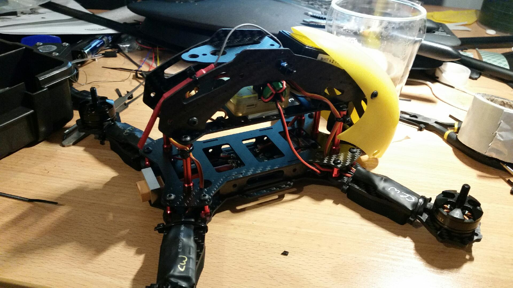

Yesterday the wife decided to do some serious gardening.  So some hard yacka ripping out Yucca, rearranging them somewhat, to then put citrus, mango, fig and a couple of other fruit trees in.  Weather didn't help.  It was sunny, so no excuses.
Today, poured raining again.
So, finally.

Motors all turning the right way.  All lock nuts tightening so motors in correct positions.
Gunned motors.  It didn't rattle.
Some quirks.  With throttle in fixed position the motors did seem to run on a little.
None of it means much until the props go on and we'll find the next niggly problems.
Note it is a tight fitting setup.  I almost guillotined cables with the folding section of frame.  It took some jiggling to get things to close up.
Of note, the CC3D need to be offset from centre line otherwise the top cage closes down on motor outputs.  You cannot, of course, rotate the controller - it has an arrow on the top that must face forward.  If being offset from centre causes a problem some work will be required.  The likely option is to take the controller out of its neat plastic case so it can sit lower on the chassis, which will then require it be protected from shorting with the carbon fibre chassis.
I will likely have to do something with the UBEC lead as it was the wire that got guillotined!  It wasn't long enough to optimally route and I half expect a failure mode due to the frame rubbing the wire in the current location (note the ferrite core).  As the carbon fibre is conductive it likely needs a safer path - I did add heat shrink to protect it somewhat, and to overcome the slit now in the +ve lead.
