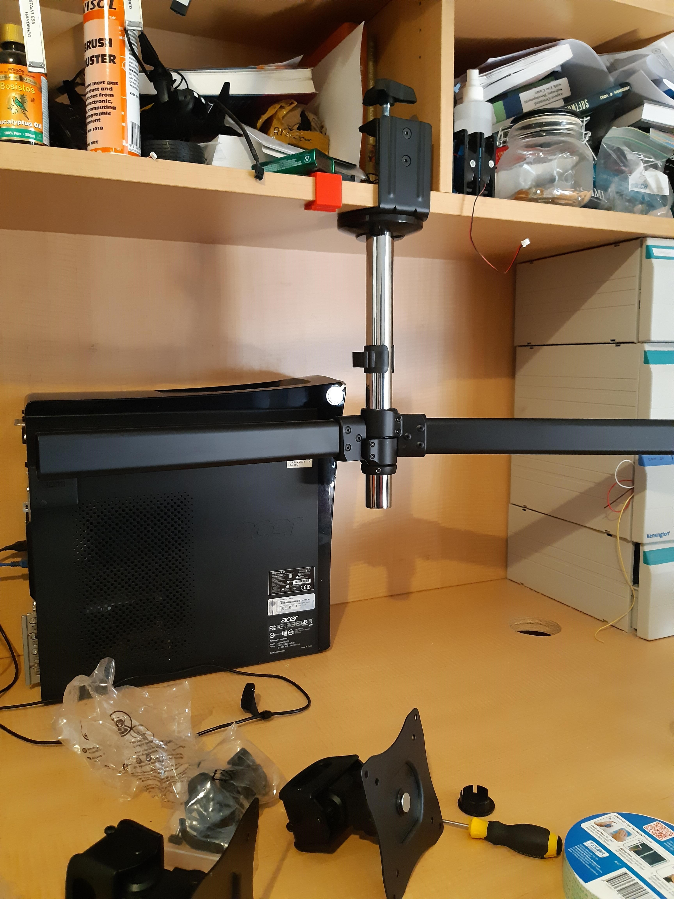
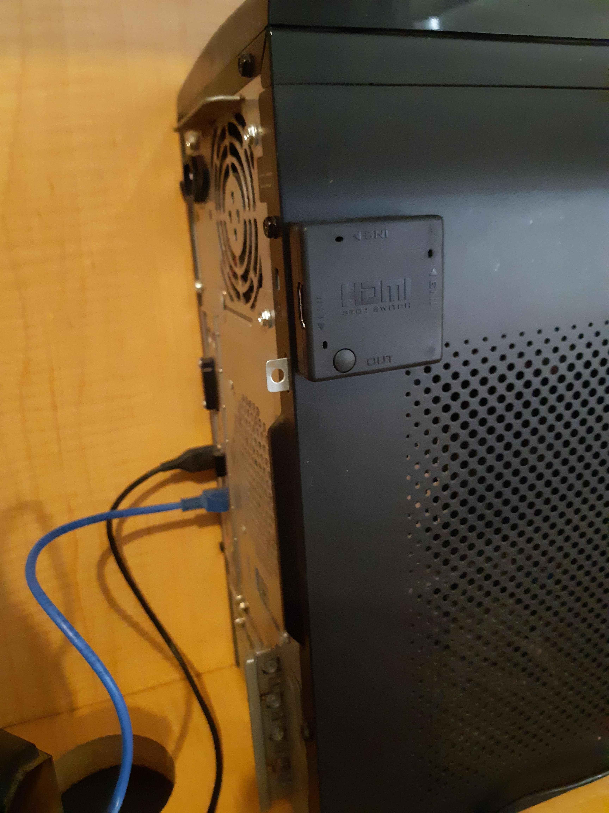
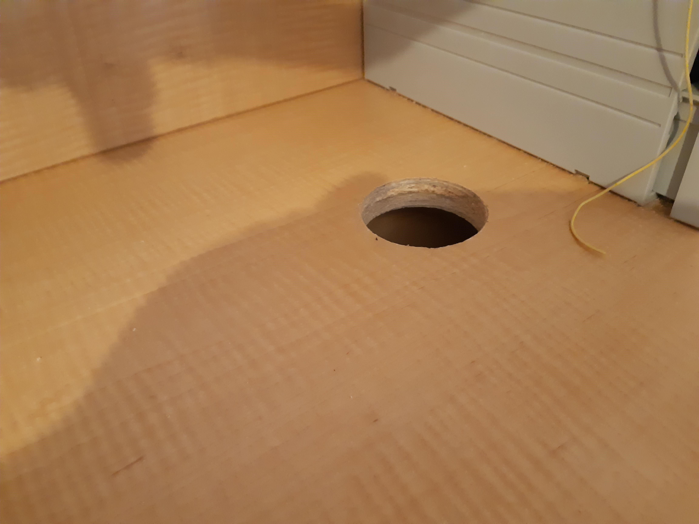
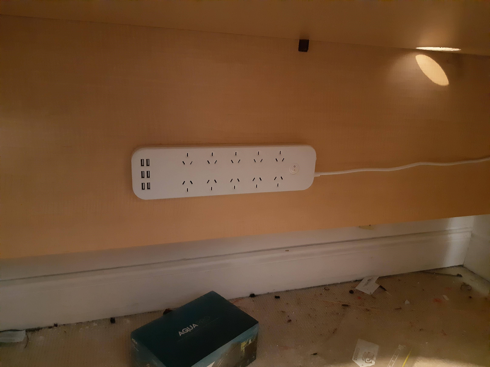
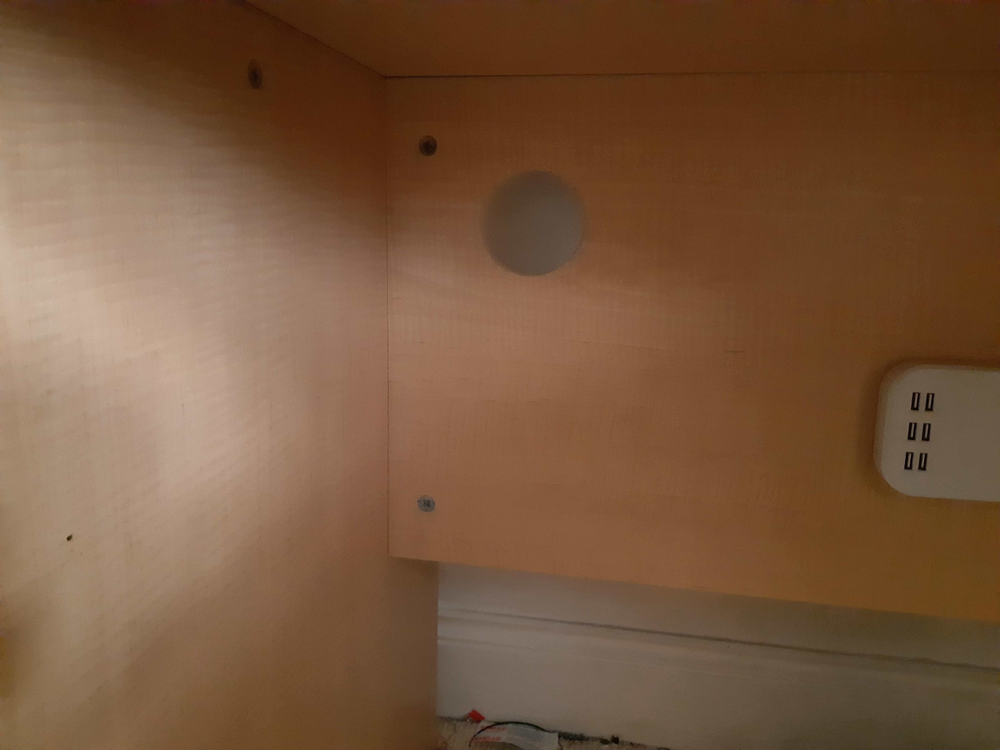
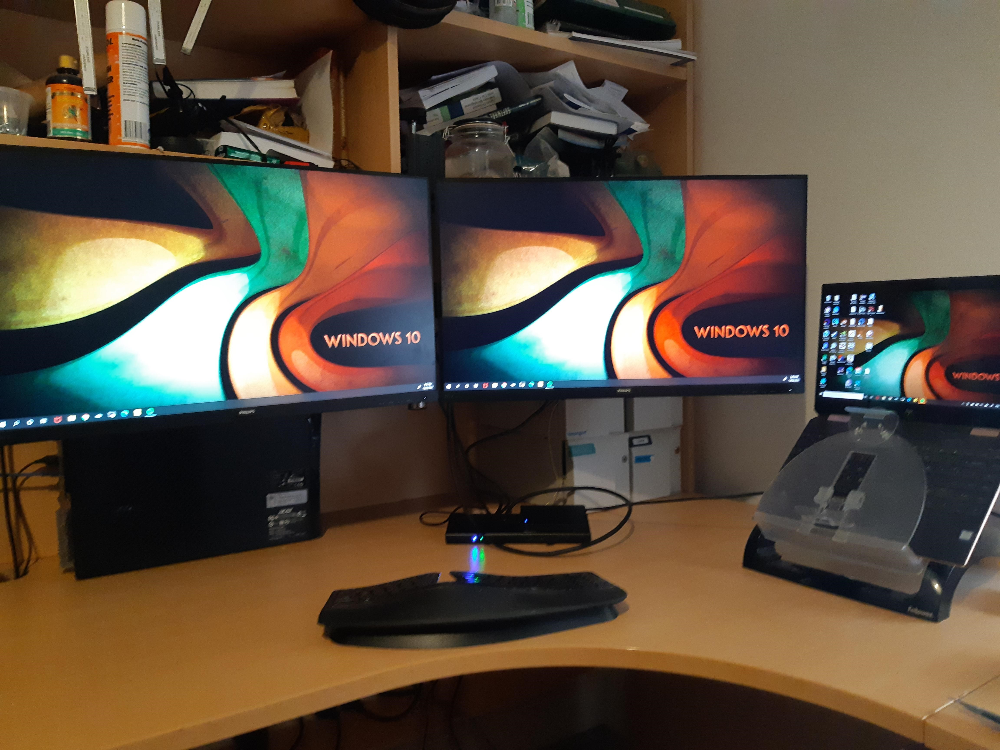
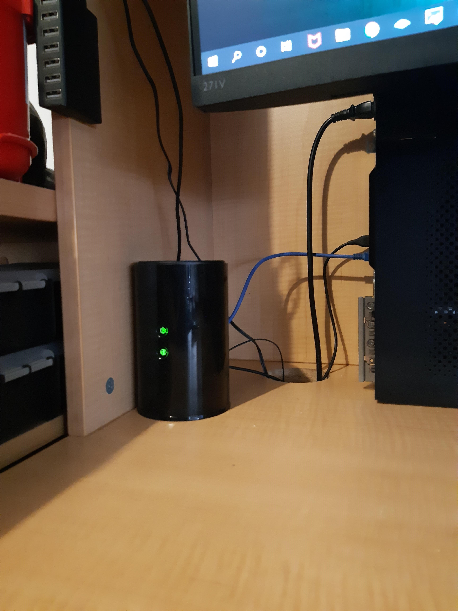
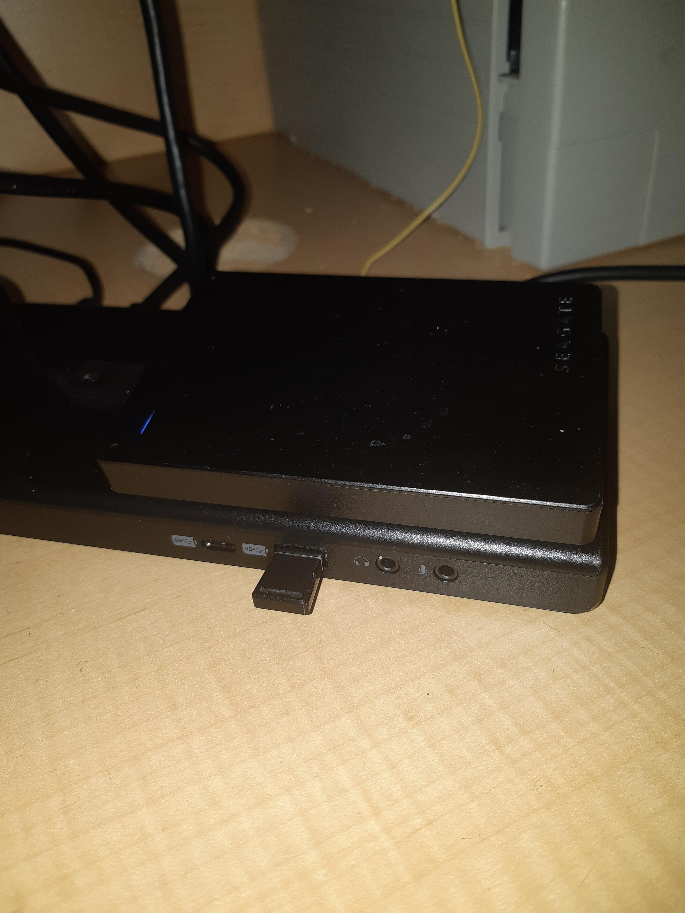

Desk upgraded.

Upgraded to two 27 inch monitors, hung from bookcase.

New dock with dual HDMI out.

HDMI switch attached to my 64bit Debian box allows me to pump its display to left most monitor.

Very happy now.

Trial fit of monitor stand, hung upside down. Remember the stop needs to be below the arms.

HDMI switch to drive left monitor with either the dock or the old PC or my Cluster Shield in fact.

Bad case of borers! Will allow short cutting of power cabling to the power board below.

Doubled me power board size. Includes USB charging! Very handy.

More borers! Another short cut so I am not having to pass behind board.

Final setup. Shifted to right side of shelf centre.

The reason for the right shift. Needed access still to USB dock that hangs off the old PC. Notice the WiFi extender? The linux PC is hardwired to that. My ethernet based dev boards are also generally hung off it as well.

AND! Me 2TB USB Seagate sits nicely atop me new dock.

Yes, I did go wild a bit with double sided tape. Power board! HDMI switch! USB drive!

You need the 2TB drive since HP are so stingy with the disk that comes with the Spectre. Need to set me up a NAS.
