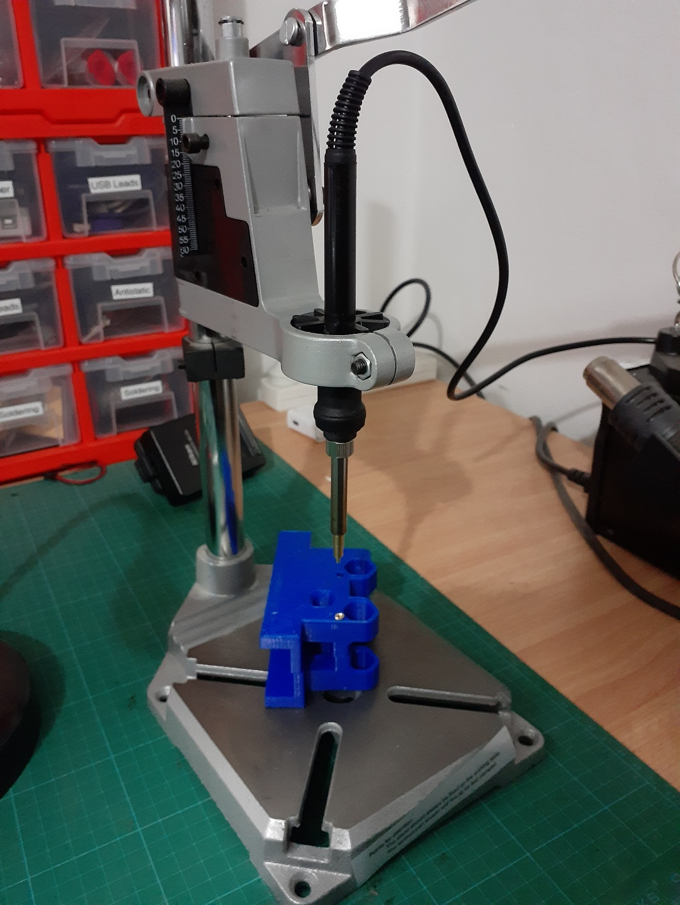
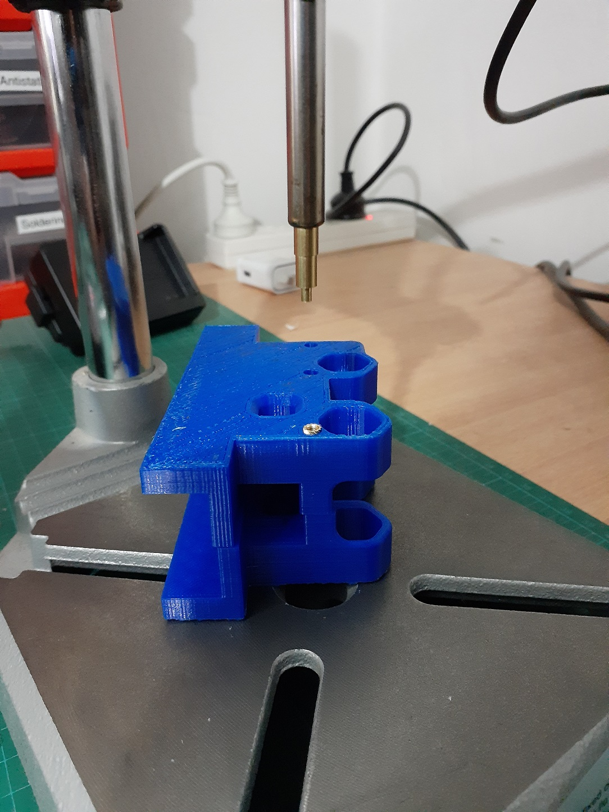
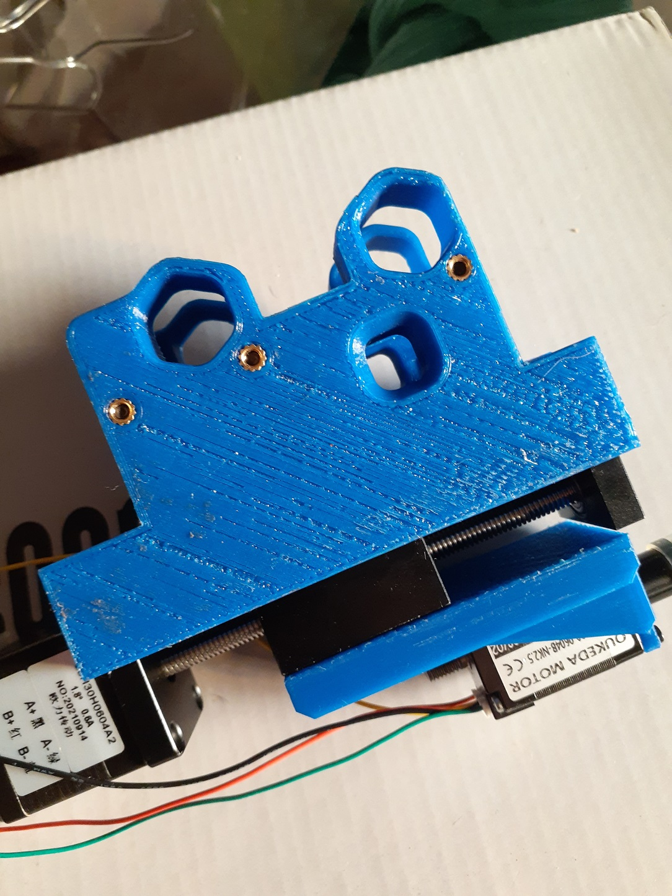
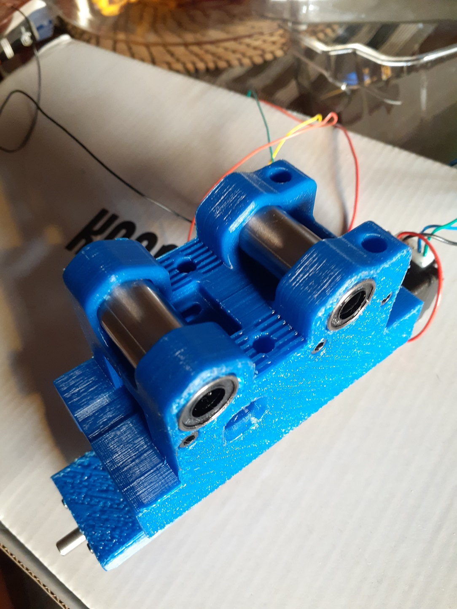
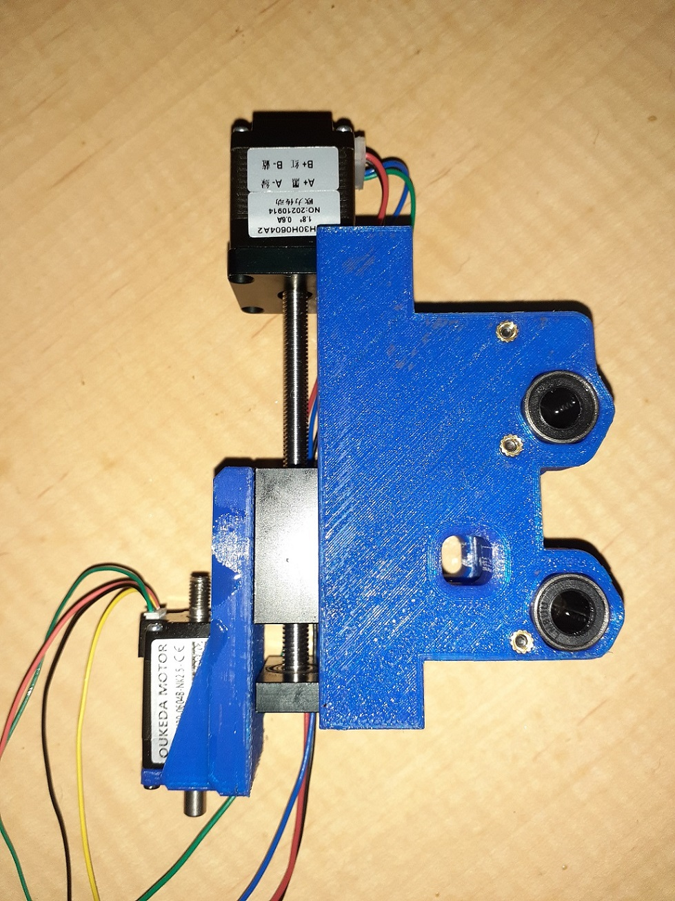
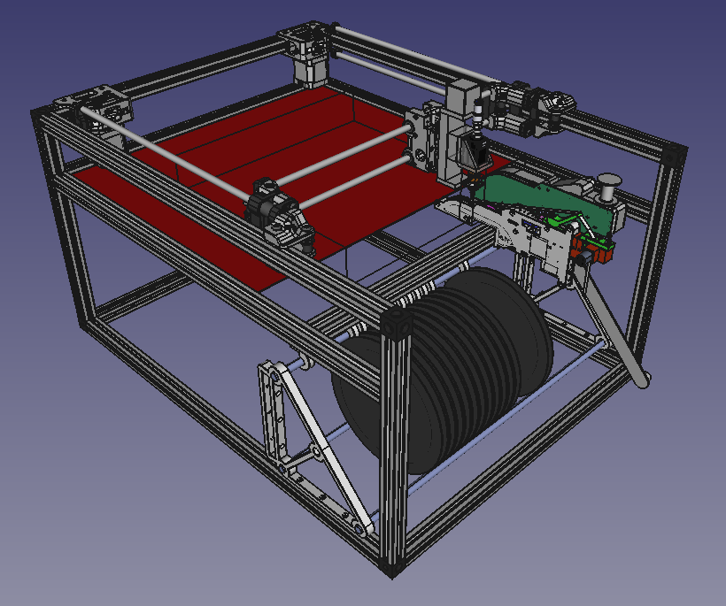

So, it took 4 failed prints to get a clean and straight right-side for my x-carriage for my corexy PnP. Finally got one. Still not happy with adhesion with the bed but it was straight and true.

Fig 1

Fig 1 is me finally trying out [my adaption for my drill press to allow for precision heat setting](https://organicmonkeymotion.wordpress.com/2021/11/20/heat-set-adaptor-for-drill-press/).

Fig 2

Here's a trick with your heat sets, don't pump your iron temp up too high. I have mine set higher for soldering, and one of the heat sets came back out with the iron as I withdrew it. DOH! Sorted it. None of those in Figure 3, just one of the heat sets for the z-axis.

Fig 3

Here's another trick. I made the holes too loose on x-carriage sides so may not have bitten well enough - so had to be gentle when tightening. Made holes too tight on z-axis holding sites, so did loose some skin when fiddling with holding the thing and accidently touched the hot iron ... OUCH!

I will have to update the model.

Fig 4

Last tip from Fig 4, hold off final tightening until the linear bearings are in.

Fig 5

Fig 5 FRACKING AWSOME!! So, I have essentially started building my corexy PnP, x-carraige first. Next will be the frame, since everything then hangs off that.

So Fig 6 generally, though that leaves Fig 7 an option.

Fig 6

Fig 7

https://www.youtube.com/watch?v=Lj5MxSLFr7c
