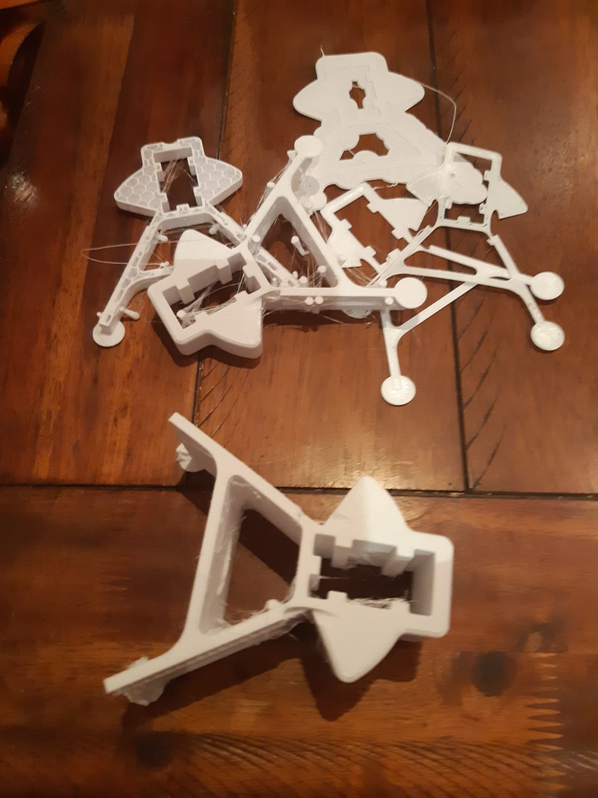
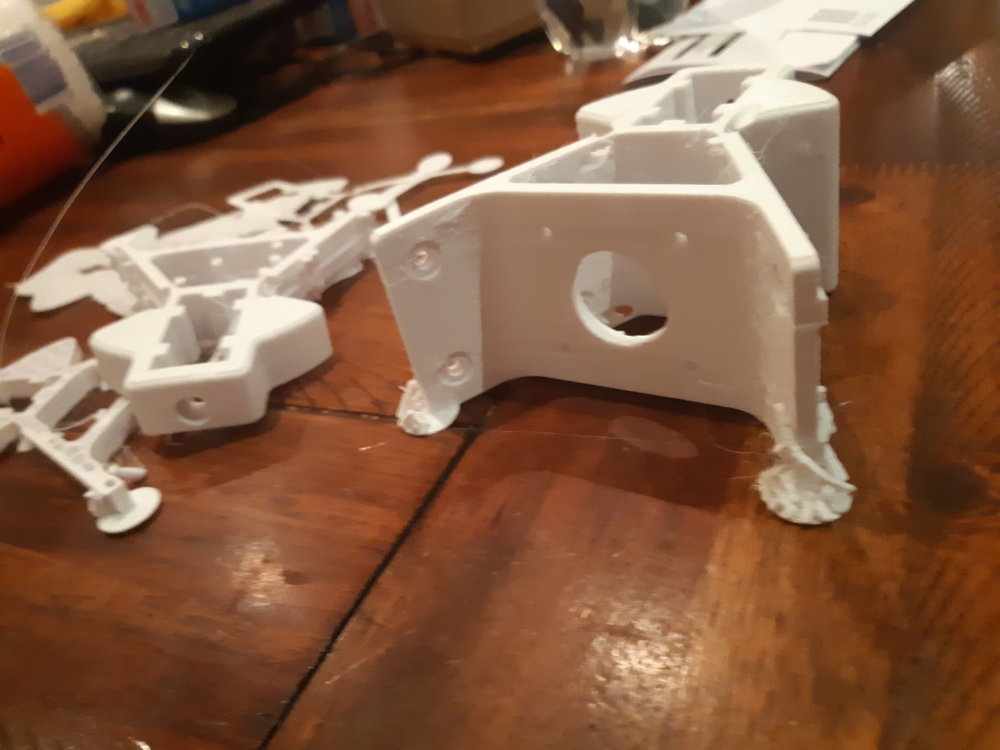

Looks good right! Nope. Its not a parallax trick, that downwards slope appearing of top edges at front is shrinkage. The obviously failed bits shrunk away from the plate. The large printing stayed stuck to the plate but shrunk back into the plate.
