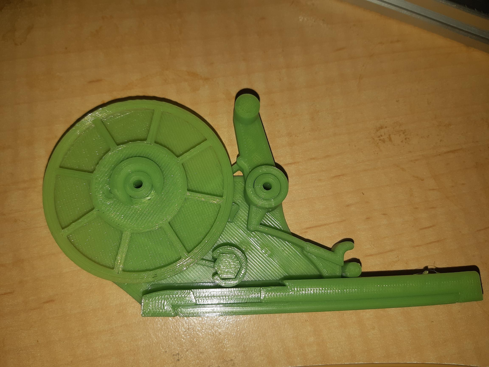

Finally!

So, finally got a working prototype build.

Things still to address:

* The mounting holes were not far enough apart to fit the frame of the manual pnp. No problem, as the OpenSCAD file is parameterized for that!
* Takes too much "help" to advance the wheel. Sticky. I think this is just axle spacing of the "friction wheel". That did have a smaller adjustment than the "lever".
* Might opt to cutting off the pin that is used to drive the tape. It doesn't seem to print consistently, because it's so small and because it's jutting out and relies on rely fine precision and dang good luck. Just needs a fine drill and maybe some nylon fishing line or something. That trick is used in another feeder design so seems to solve the problem, though likely fiddly and error prone itself.
