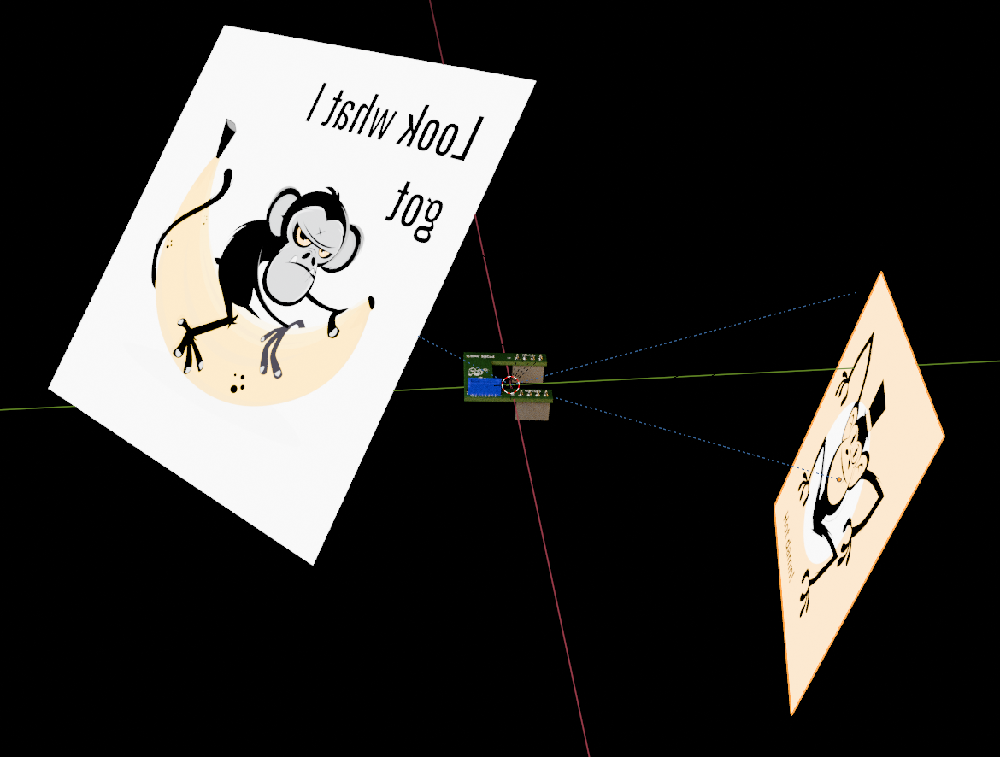
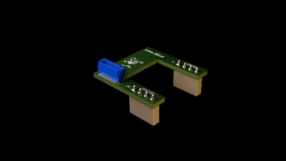
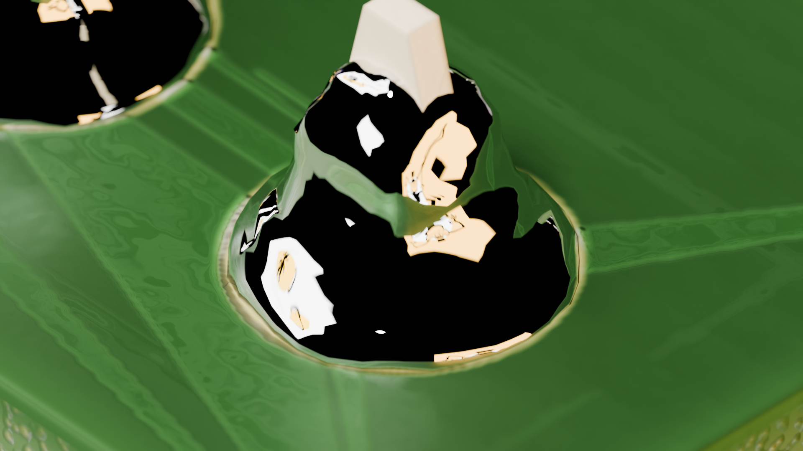
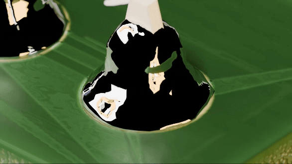
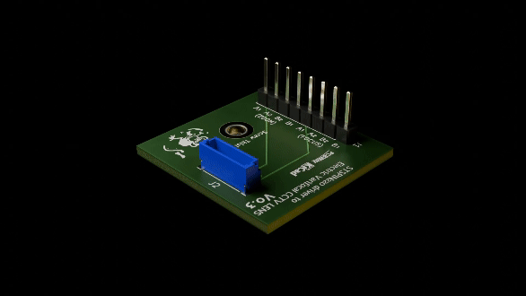

A couple to three things I had to sort out, really had to remember from setting up the rotating ice cube.

Frames from 1-360. Set rotation of all axes at frame 1 to 1. Set rotation of all axes at frame 360 to 360. Set the keyframe interpolation to linear.

While sorting out things, I had also a kooky idea. Noting I did notice on the pins of one board reflections of other features on that same board. Not sure then whether it will work, but even if it's just a subtle effect, I decided to use a couple of branding images, with emissivity up, as diffuse lighting. Some fiddling with default rotations to make sure the images faced the board the right way as per Figure 1. Such a perfectionist!

Figure 1: The "filming" setup, mitt the lighting

Figure 2: Mitt der linear interpolation

It's subtle in Figure 2, the best you can pick up, if you look closely, is the shape of the "lights" in the solder blobs (admittedly better still within the Blender viewport). So, you can see it if you drop the solder texture and put in a pure metal texture, as in Figure 3 and Figure 4.

Figure 3: Both lights against the black world background

Figure 4:

So, I also noted that with the other version of the board, I had missed labelling the input pins, so that's fixed in Figure 5.

Figure 5: That's better!
