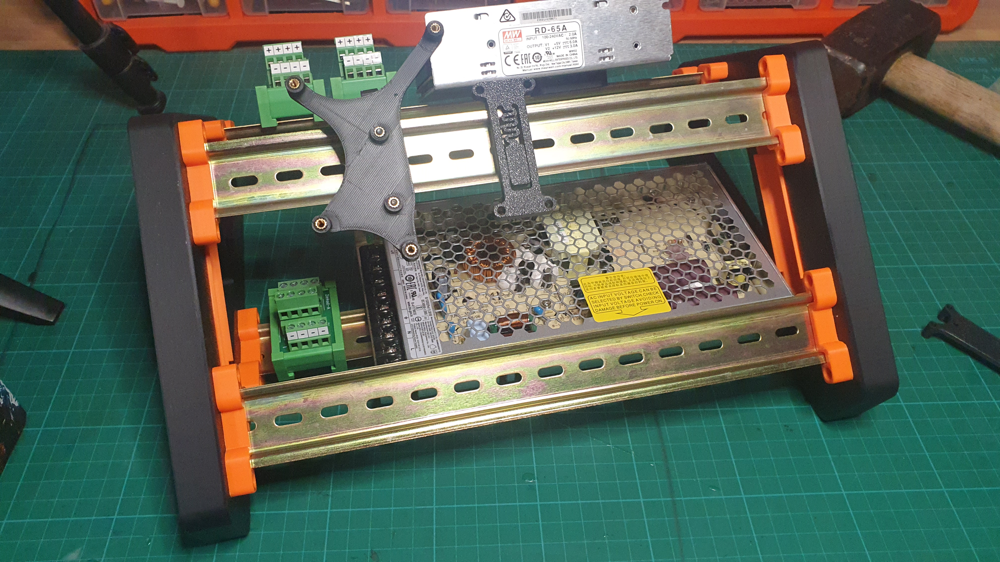
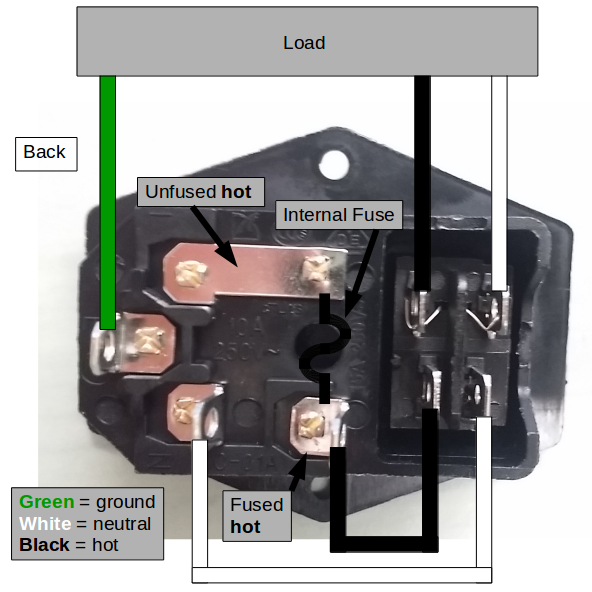
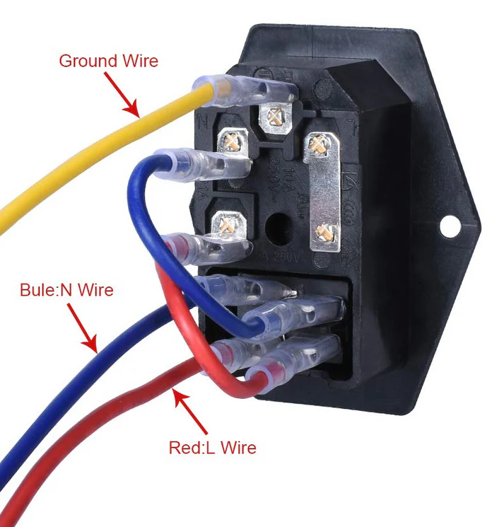
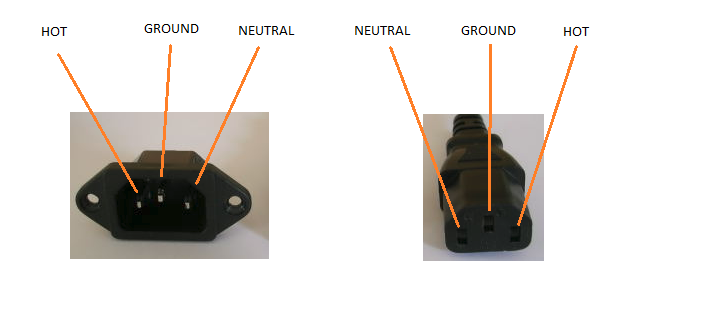

Still needs wiring up.

It turns out the male IEC power connector with switch was available at Jaycar so that's not in as yet, while I muse about the neatest way of wiring it up.

The BTT SKR Mini E3 mount and Raspingdoodleburry Zero mount fitted fine.

The 3D printed DIN mounts for the power supplies fitted without a hitch and clipped on without breaking off the compliant clips (noting I did take care while fitting).

Very happy!

Although, the following niggliness:

* One heat set in the black ends (to screw the DIN rail holders into) came out. Which wasn't a bad stat.
* None of the heat sets for the grub screws that are used to bite into the DIN rail really (convincingly) held. Most all of the grubs are only touch tight as any tighter and the heat set was being extracted.
  + The problem with the heat set for the grub screws that bite into the DIN rail was less of a problem as the slots for the DIN rail were squarer than the DIN rail, and the DIN rail needed to be flexed somewhat to get it into the slots.
  + Hence, there is sufficient press fit so as not to require the grub screws and hence not require the heat set for the grub screws.
* The male [IEC power socket with switch is a universal (global) standard so I was able to get one from Jaycar](https://www.jaycar.com.au/iec-fuse-chassis-male-power-plug-with-switch/p/PP4003). They're odd since they need you to wire up what is essentially "internal" connections between the double pole-single throw switch.

Of course, getting to the bottom of the wiring was fun. No Australian instructions, but a couple from other places. The difference is in Australia yawl will call it Active and Neutral and then Earth and the colours'll be different.

