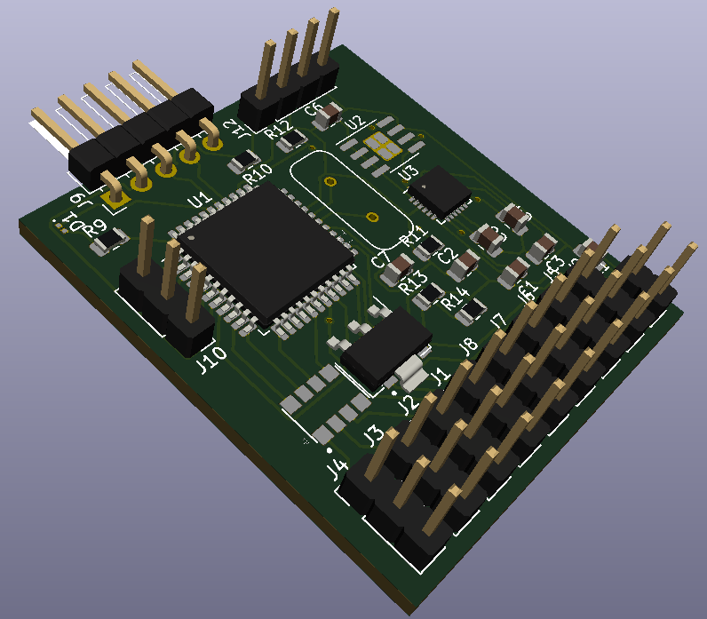
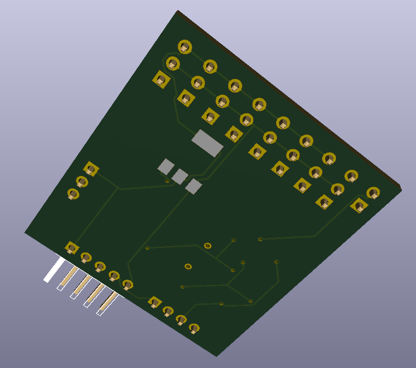
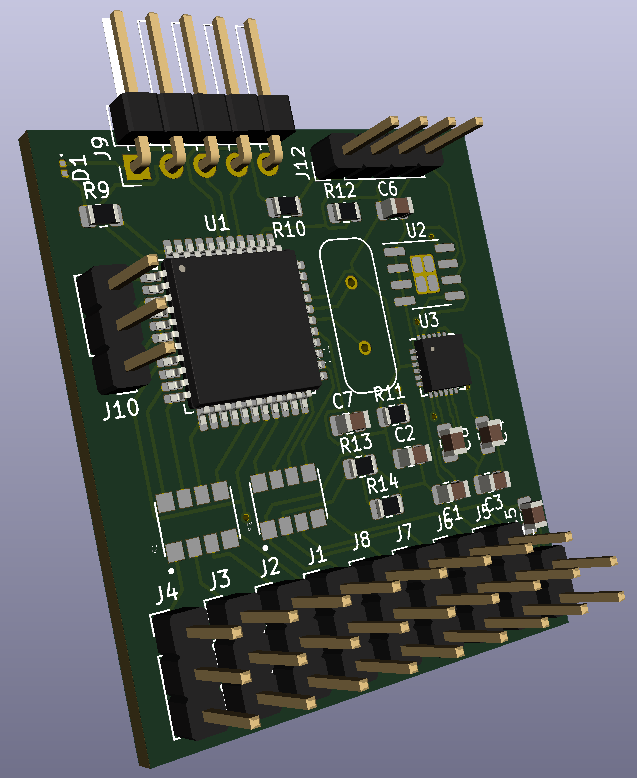
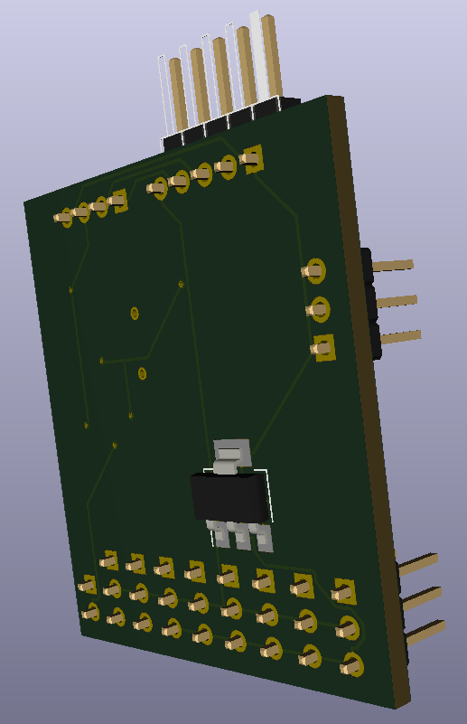

Whoops!

I fidgeted with changing the parts around to get the board smaller. Had a great idea! I would put the regulator on the back!

What I found out is there are some quirks with doing this as I swapped sides on pads etc but missed the flag to actually put the component on the other side.

Not to mention, I seem not to have assigned packages to U2 nor the two quad resistor arrays. Otherwise, looks close to good enough to get a small batch made and then start fiddling with programming it. The board can evolve once a code base is up.

So, with a little bit of fiddling, noting there is a top/bottom flag in the component wizard, and voila! Just need to sort some package libraries for the last items.

I have a box of assorted SMD crystals coming from Aliexpress, so one last touch and then to the pcb manufacturer.

Board dimensions are 36mm by 40mm. Not bad since it's got a [8-core 32 bit MCU](https://www.parallax.com/propeller-1/) running on it.
