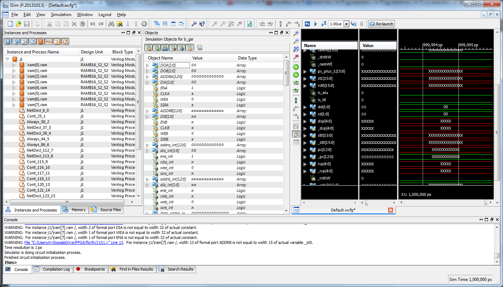

So, study over and I was wondering ...
So, the [HIVE](http://opencores.org/project,hive "Too tight") code sucks up into Quartus 10.1 fine (it appears to have been written for 9.x).
The problem ... needs a bigger FPGA chip than our EP2C5T144C8 chip.  I have a board with EP2C8T208C8 coming but, alas that is too small too (there are no EP2C70xxxxx boards on Aliexpress in any event).
Looks like you have to invest in Cyclone III and above.  Not an option at the moment till we spend about 12 months learning the art of FPGA I think.
I have a Mojo board with a Xilinx Spartan 6 on board so I jump onto my Xilinx tools (which I haven't used yet ;) ) and loaded up J1 and dang thing wouldn't build so that will need some work - I guess its a good way to learn the environment.  Oddly, it seems to come up in the simulator so it seems to compile fine, just fails layout.
[caption id="attachment\_1287" align="aligncenter" width="450"] Pretend J1[/caption]
So, I might spend a little time with the simulator manual and pour over the model every now and then to work out the tool and check out the cpu that way.
 
