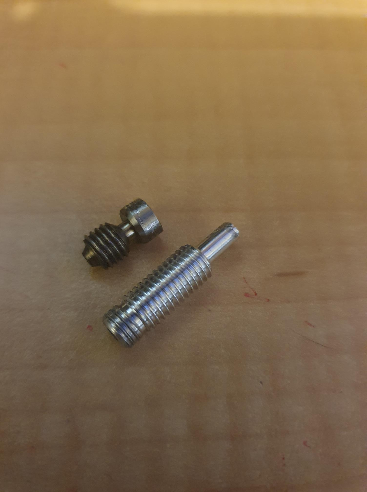

I was getting far too many "clogged" prints in my trusty old Flashforge Finder.

Could it be my [Micro Swiss hot end](https://store.micro-swiss.com/products/micro-swiss-all-metal-hotend-kit-for-flashforge-finder-and-flashforge-guider-2), end of life?

At one point, I had bought a second hot end. So, should I?

No wait, is it actually the dang blasted extruder worn out?

Options include an aftermarket (grey market, really) [extruder from Aliexpress](https://www.aliexpress.com/item/1005003197349203.html?spm=a2g0o.productlist.main.1.6f9b6f07NbGcqd&algo_pvid=92056d9e-6fc0-4ecf-89a0-296735ae0af8&aem_p4p_detail=202301230135321778179952100960018988507&algo_exp_id=92056d9e-6fc0-4ecf-89a0-296735ae0af8-0&pdp_ext_f=%7B%22sku_id%22%3A%2212000024614558428%22%7D&pdp_npi=2%40dis%21AUD%2112.64%2110.11%21%21%21%21%21%402102110316744665322165027d06d5%2112000024614558428%21sea&curPageLogUid=7CjNZbDbZoC1&ad_pvid=202301230135321778179952100960018988507_1&ad_pvid=202301230135321778179952100960018988507_1). I rather like the aftermarket machined option that I found at [Bilby 3D](https://www.bilby3d.com.au/DispProd.asp?CatID=&SubCatID=133&ProdID=ptLeverCPL) (not in stock though, and is this really something from Micro-Swiss again?).

The problem, in any event, may be the drive gear teeth are fragged, so the extruder is not driving the material. There is a relatively new extruder driver board in the Finger. I replaced that extruder board ages ago, when, at least according to Flashforge, the flat cable connector was fragged (somehow). So, I replaced the flat cable, and the extruder board, and the printer came back strong.

I duffed it, though, as I decided to try the second hot end. The Micro-Swiss hot end actually comes in two parts, did you know?

I thought I had twisted it and broke it of in the heater block! Nope, the two bits screw together. The smaller bit was left in the heater block, and I did crush it, just a tad, when removing it. Lesson learned! Especially as, with hot end pulled down, replaced and system brought up again, ....

..., you guessed it, "clogged" first print.

Do I therefore need now to look at replacing the extruder?

Though, I should have a look at the stepper signals with me CRO!

CAW! CAW! CAW! CAW! CAW! CAW! CAW!

Except, the Finder is designed expressly, so you cannot get to the works while running. The cover over the print head is, of course, integral to the gantry limit switch activation. Fair obstructs any signal pick off, without being really intrusive.

Dare I say, ...

WHAT THE FRACKING FRACK?!

It slowly dawned on me. I had this problem before.

Tick, tick, tick, ...

..., it was precisely the issue FlashForge helped with previously. The issue with the flat cable and probably the connector on the extruder board or the cable fragged (somehow).

Last time I fixed it by replacing the flat cable and the extruder board.

This time, ...

I disconnected the flat cable from the extruder board, re-seated it, wiggled it, just a little bit.

No "clogging" no more, no more - OOHH there ain't no "clogging" no more.

That is, 'tweren't clogging, 'twas loose connector (again).

A very expensive lesson therefore, with one CRUSHED (and expensive) Micro-Swiss hot end.

