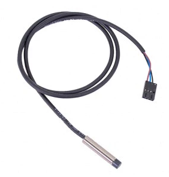
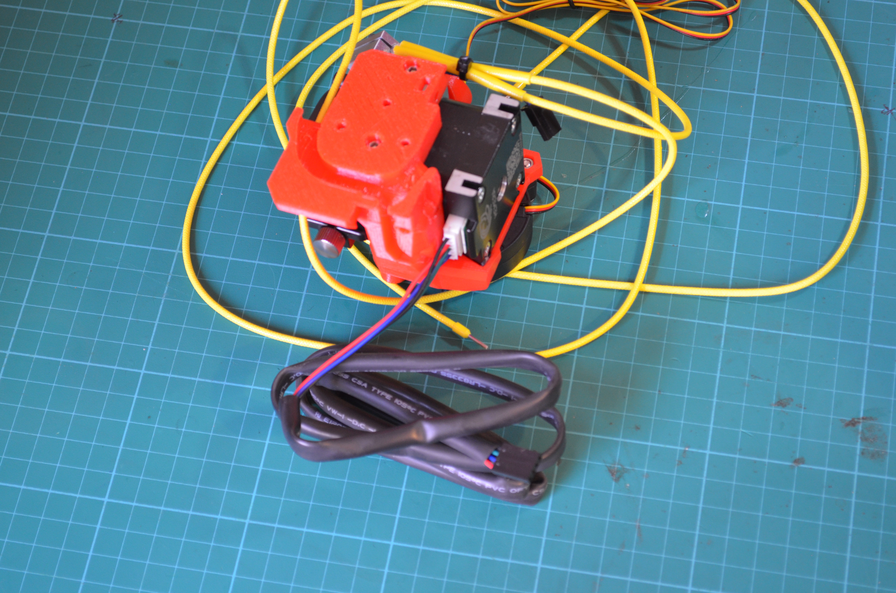

Another thang I need to buy for my scratch built Prusa Bear build. On order.

Yes. Of course. It's a Super PINDA.

Since I am using Klipper on the BTT SKR MINI E2 V2.0 board I am using, I checked, and this'll probably work find.

Most of the way through the x-carriage build, before I worked out I needed this item.

Again, a problem with not properly defining a BOM before beginning.

X-carriage is at this point, ...

I am using the Wife's Nikon SLR to do a noddy stop-action of the x-carriage build. The camera is old, and the battery dies after about 7 hours. So, I am charging the battery again, before I can finish the current scene. It might be my poor old eyes, or the depth of field options for the lens of the camera, but my focusing is crap. Not exactly 1080p dimensions.

I have ordered a cheap USB 1080p Webcam, with a mount for a tripod (some Microsoft thang), as there is an open source stop action studio, that hooks into a USB camera. It's called [qStopMotion](https://www.qstopmotion.org/). I can't review it, currently, as the webcam has not been picked up, until tomorrow. Click and collect don't you know, over Easter, so DOH!

I am struggling with lighting, (I have no "studio" lighting), so clouds coming across the lab window are caught as dulled shots. I expect the final spurt of shots then to have subtly different lighting. Oh, well. First time blues.
