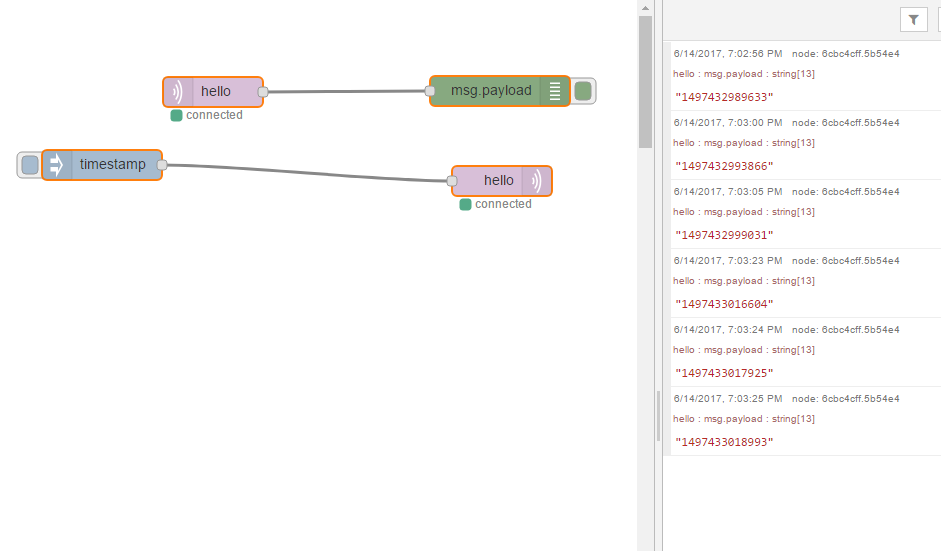

So, got the emqttd and node-red running from separate console sessions on the OPiZ to checkout the mqtt messaging is working and voila!

Just a simple check by sending the timestamp to the topic "hello" and using the debugging to catch the response.
So, stuck again as 1) can't set the IP on the OPiZ to static because of the quirky behaviour induced by the use of the expansion board and 2) still no luck getting either of emqttd or node-red running as services.  Both are show stoppers at the moment - at least for deployment.
I intend using double sided tape to tap the OPiZ to my gateway and drive it from the USB port on the gateway with a short ethernet cable into the gateway.  Good option since no gateway means no lan.  Also means if I cycle power on gateway to sort out problems the node-red server will need come up without intervention.
That will be much neater than the ODROID-C1 setup currently - which reminds me, must look at putting together the ODROID-C1s and parallella into that cluster.
 
