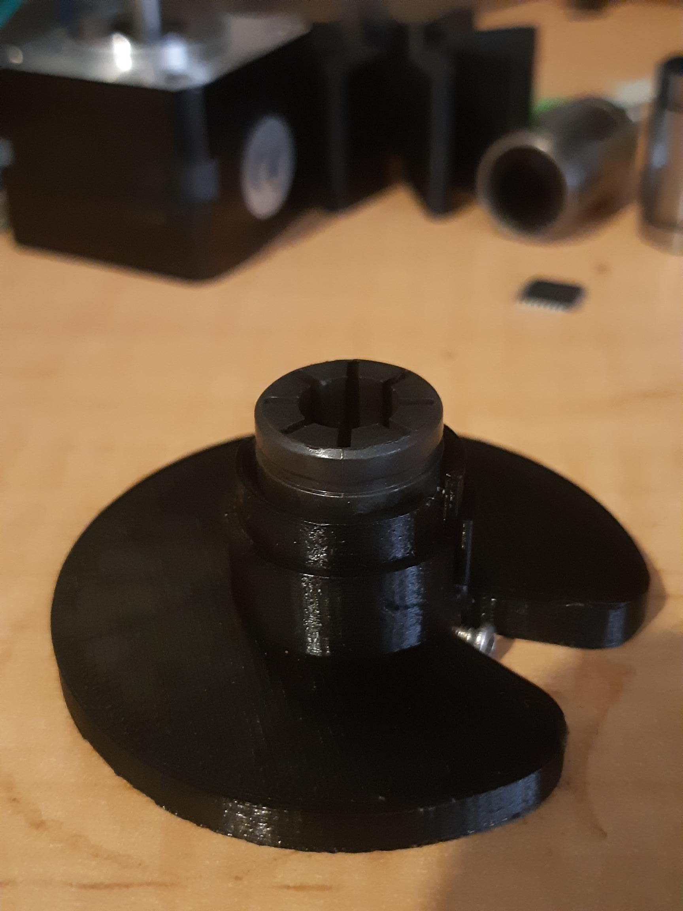
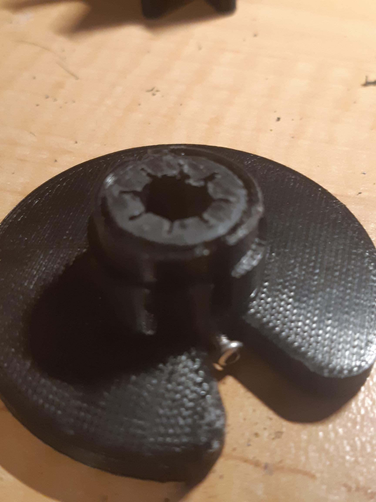
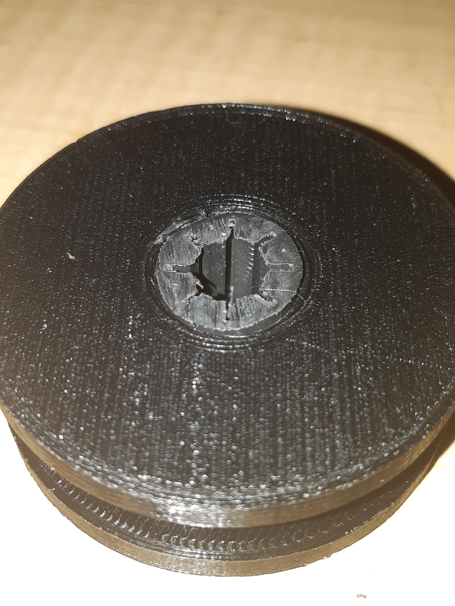
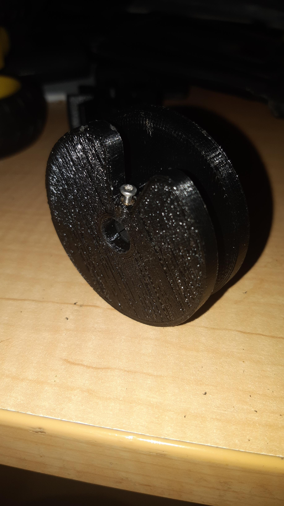

Figure 1

In Figure 1 a test fit of a nylon LM8SUU, just tooooo long!

Figure 2

After attacking the LM8SUU with a fine hack saw but just before a light filing to clean it up.

Figure 3

In Figure 3 the trick was place the spool end on, since the hub was slotted to allow for press fitting. Then putting the LM8SUU on the bench upright THEN tappity tap and a great tight press fit, everything square.

Figure 4

Figure 4 is SMT cover tape collector spool number 1. The problem though, press fitting so tightly and the LM8SUU has been compressed slightly to tighten on the linear shaft.

DOH!

Just needs inner diameters opened up a tad.

Back to the drawing board.
