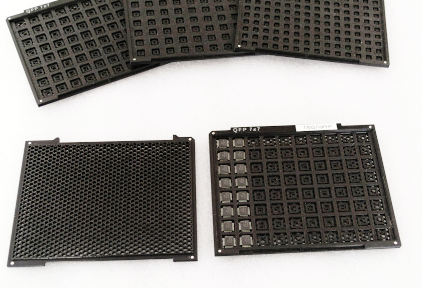
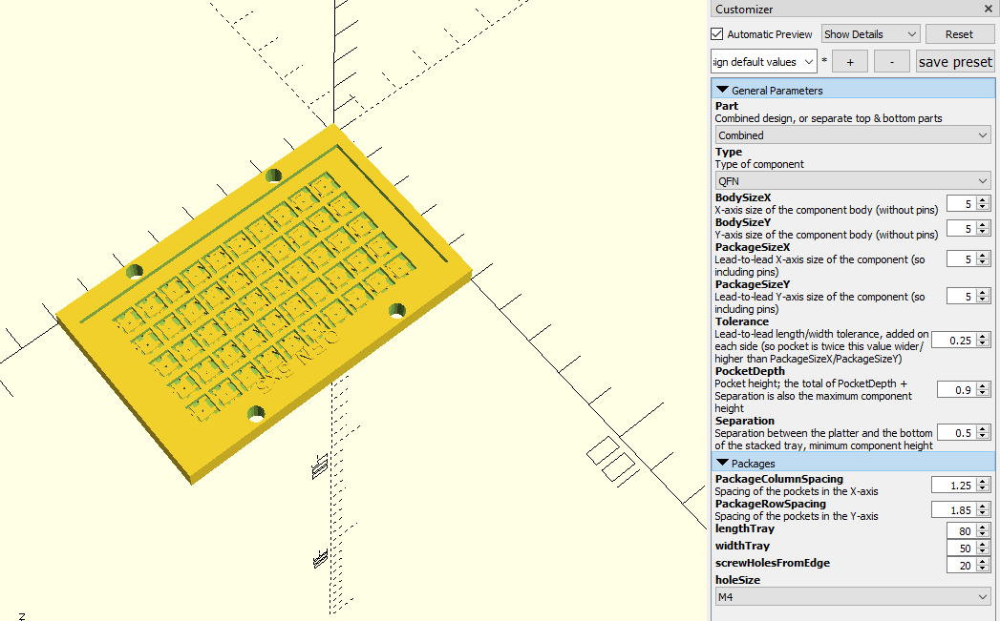
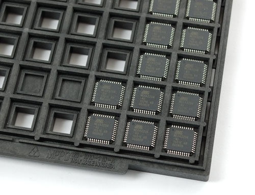
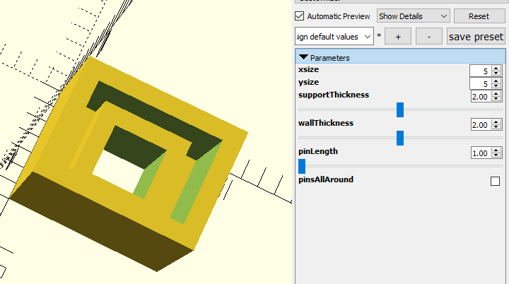
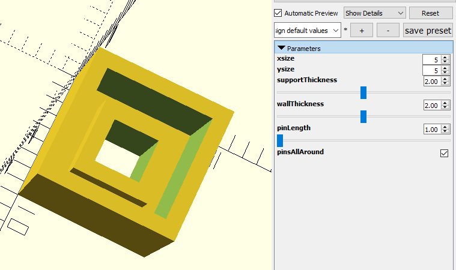
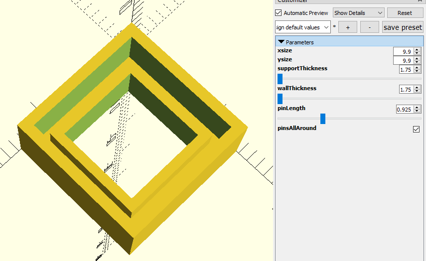
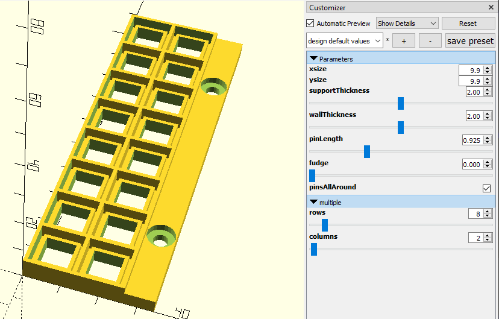

So I found the OpenSCAD files for a neat [parameterised SMD tray](https://www.compuphase.com/electronics/minitray.htm).

minitrays

But it was designed to size by package row and column count. It has magnets at the end so they clip together for stacking and you can use a sheet steel bed on you PnP and they'll sit fine.

For the manual PnP though, they are a pain since tuning them to the 2080 bed was fiddly and, of course, magnets and aluminium are not friends.

So, of course, despite there being a solution I hacked the code to define the tray by tray dimensions wanted, as well as added holes based on M3, M4 and M5 screws. The screw hole location is with reference to the tray length so that allows me to tune for seating on the 2080 extrusion beds of the manual PnP.

Figure 1

Mind you, modifying the code was a headfuk as the code was not really functional in the coding style, poorly commented etc.

While the honeycomb seems to make sense then for cleverly stackable trays, for not when in use on the PnP bed, then end result is dropping a few unnecessary features.

I did come across another tray design, but no source code, at Figure 2.

Figure 2

This was an epiphany, since it was way more straight forward. So I coded up a test piece and played with it. Noting that pins are either all the way around or only down a pair of opposite sides I ended up with a prototype (Figures 3 and Figure 4).

Figure 3

Figure 4

So I thought about it and then set the defaults in Figure 5 to the Atmega328 in Figure 2.

Figure 5

So with a little fiddling I get to Figure 6. So, a little brittle, since the rows now need be greater than 70mm in size to ensure the mounting has the 60mm spacing to span the slots on the 2080. I might auto calculate rows to fit and then just adjust columns. I am not banking on stupid numbers of cells and a single row could easily do. It also occurred that I also need to code for no pins and just package dimensions. Scheisser!

Figure 6
