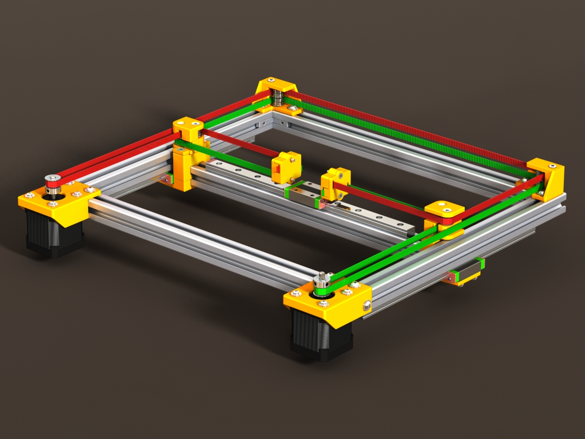

When was the last time you heard that!

So, I had this sorta weird idea.

Not at all unusual for me it seems.

So, goes like this. The most likely corexy option, to be the basis of this corexy based pnp dream of mine, now seems settling on the CoreXY frame by Alexey Lehaiver (either [V2.0](https://www.thingiverse.com/thing:2138286) or [V2.1](https://www.thingiverse.com/thing:2266282), which really only relates to size variants of linear rails). Both more or less look like the following:

Now, that comes up short of a full pnp obviously, so some amount of work - but its the next stage up from, say, my Bear Build which is all relatively stock items.

Now to keep the price down is the thing. So the crazy idea is, since it was the *index* pnp and the enthusiasm of its designer, [Stephen Hawes](https://www.youtube.com/channel/UCMf49SMPnhxdLormhEpfyfg), that spurned me to look into this, I thought there may be a homage to be had, to the *index*, by using its legs, or the idea of its legs at least.

So, all good. The index was redesigned in FreeCAD ... DOH! The FreeCAD design uses Sketcher. I had gotten by using the Part editor (that is, not the "Part Design" editor). I had seen Sketcher like functionality in other CAD tools and the constraint based idea was very VERY interesting, but I needed a push. So push has been had.

So, in the meantime I have been looking at Sketcher tutorials by [Joko Engineering](https://www.youtube.com/channel/UC-CubOaooNwC-3RBKUoAOQQ), to start with. Pretty darn good tutorials.
