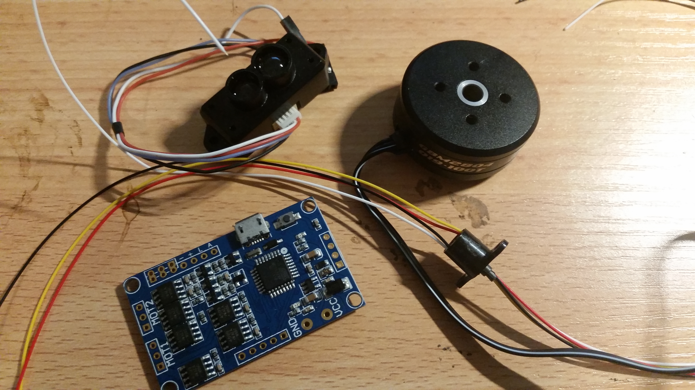
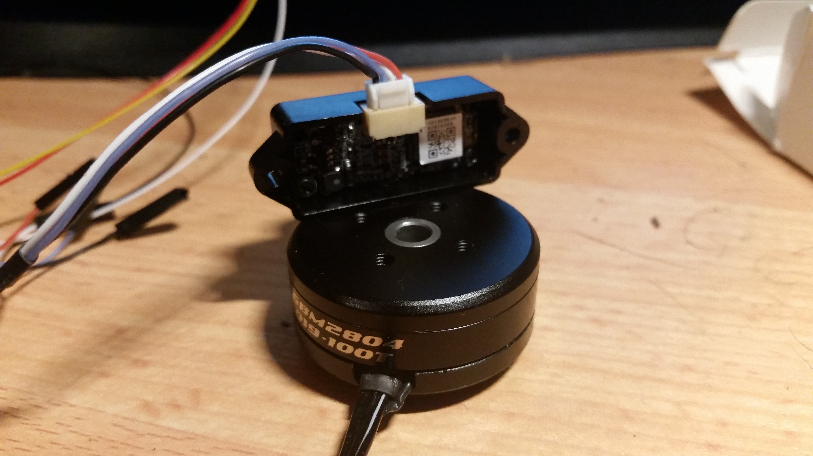
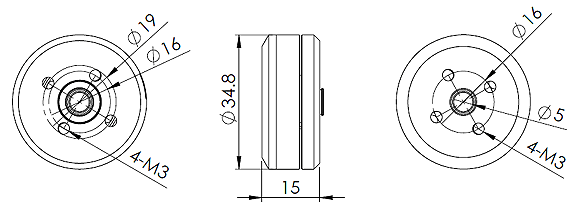
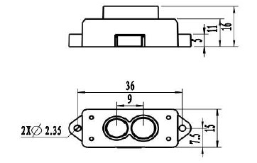

So, for the final prototype I will likely need a 12volt BEC to drive the gimbal board - though I won't need that for the bench.  What I am missing is an adjustable bench supply.  Still something that should have on my bench.  So, off to Jaycar on weekend.
Otherwise, here are the basic innards of the home made lidar.  The bore on the gimbal is not wide enough for the slip ring body, but that is not a problem - it will be accommodated by the way I mount the slip ring.

As for the Benewake TFmini Micro Lidar, I think I might play with a 3D print for the final prototype.  My geek sister has a 3D printer and I am most of the way through an online Blender course (specifically so I can fall into 3D printing design).  Otherwise, a short piece of aluminum angle should do.

Just for posterity the physical specs for the gimbal motor are:
Spec:
Poles: 12N14P
Resistance: 10.0 omh
Weight: 41.42g
Wire: 0.19mm
Turn: 100T
Bottom holes center to center: 16mm and 19mm
Top holes center to center: 16mm (vendor website says 12mm in on place and 16mm in another).

Physical specs for the lidar are:

