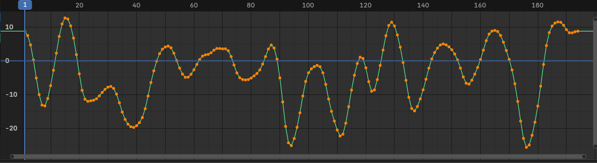
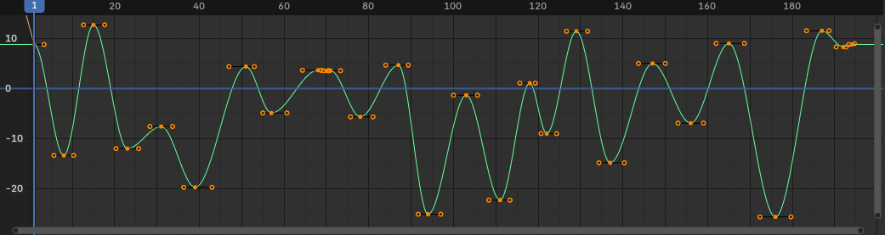
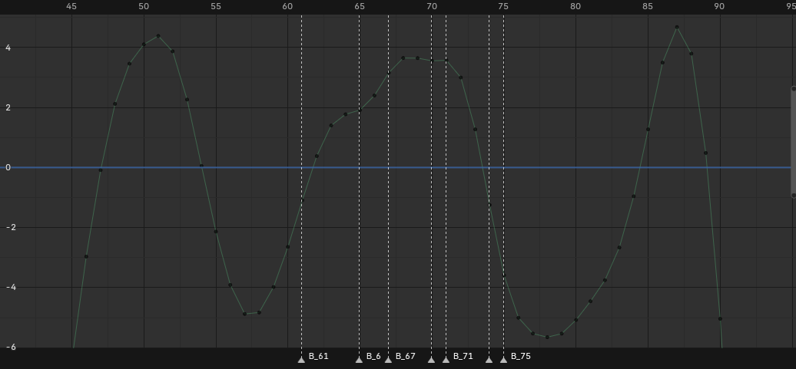
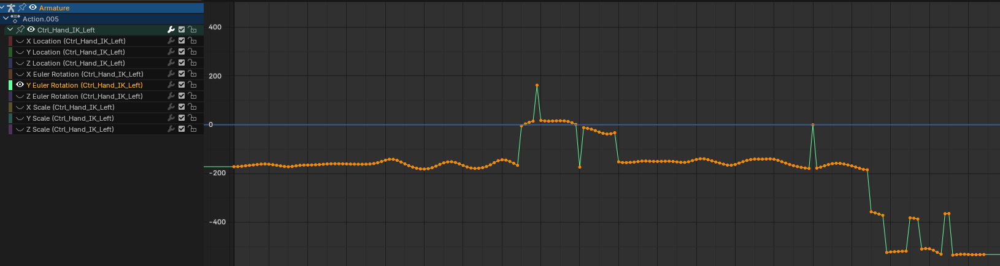

https://www.youtube.com/watch?v=Z3FFXfWg9Ls

I am still tooling up for my animation fun.

At the moment I am looking now at how to make it easier when editing of Mixamo based animations, mitt control rig applied.

The pesky Mixamo animations, since they are decimated slices in time of a mocap, literally record each possi (lotsa possies) and the link the keyframes for all those possies with linear interpolation. Hence, adjusting the animation, to remove collisions, is a FRACKING PAIN!

I was tending to delete chunks of keyframes and replaced with a bezier curve, manually, which became a FRACKING PAIN!

So many inflection points.

Hmmm.

Why not?! Let's hack up another blender addon!

I want to turn this

Montonic points between inflection points zero, one or greater than one. Zero is good, just bezier between peaks/troughs. Monotonic points >0, then some fiddly algorithm needed.

Yes, some foibles to fix, I am working on the issue to deal with the curve tween frames 60 and 80 (and hot on that topic I am). With sorting the control point positions to better shape/scew the beziers otherwise left to later, since they pretty close as is. Much of this was a gimme, given the nature of the f-curve in the example.

The idea I cam up with, for the segments where monotonic points>1 is a curve follower that looks for places where there are break points between beziers.

The test of the latest code works over the region the original algorithm fails. B\_x are breakpoints between bezier segments is all.

After I get that hacked out, then there are other test cases.

Probably not that much an issue, the "flat" regions are not dissimilar from the original problem. Those pesky "sharps", really just plateau of a few keyframes span. The trick'll be bezier for some, but not for the sharp inclines/declines.
