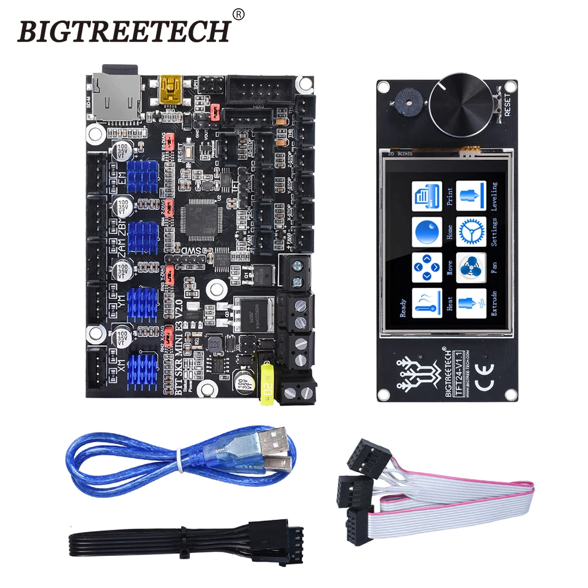

Yeah sure the Bear Build is a slow build, but a good build.

The BTT SKR MINI E3 V2 is the board that will run on the Bear (Fig 1).

Fig 1

So [Klipper](https://www.klipper3d.org/) seems the way to go, for no other reason than why not? Now, trying to lean on work already done will be interesting, since we've got a [Prusa](https://github.com/PrusaOwners/prusaowners/blob/master/Klipper.md) setup already, but probably not for the BTT SKR MINI E3 V2. Here is a [hack in work](https://github.com/0x4d4e/klipper_config) that may illuminate.

[Marlin setup](https://github.com/bigtreetech/BIGTREETECH-SKR-mini-E3) here in any event.

Of course, if I opted to use the BTT SKR MINI E3 V2 on my Voron-esque PnP then there is a [starting position](https://docs.vorondesign.com/build/software/miniE3_v20_klipper.html). Never fear, you appear to be able to [still buy these boards](https://www.aliexpress.com/item/4001050145015.html?spm=a2g0o.productlist.0.0.4b1346c74JBRUe&algo_pvid=48e763a7-f5e1-49e1-b1f3-ad54a8fa08c6&algo_exp_id=48e763a7-f5e1-49e1-b1f3-ad54a8fa08c6-2&pdp_ext_f=%7B%22sku_id%22%3A%2212000029382056164%22%7D&pdp_npi=2%40dis%21AUD%2179.83%2144.7%21%21%21%21%21%40210318cf16595339111938614ef625%2112000029382056164%21sea). But, I am very likely to build a mobo from Stephen Hawes' project, since he inspired my PnP adventure, and then that be the homage I can offer, since I went entirely the opposite direction he did with the physical design.
