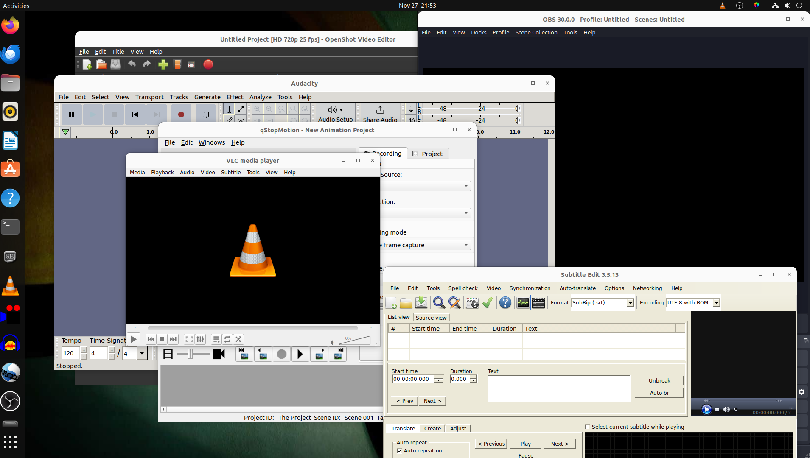

Slowly squeezing on me graphics, animation and audio stuff!

Cascadeur, at the moment, does not start without an "Internal Ubuntu" error. That's the specific Ubuntu install of Cascadeur.

SActorCore AccuRIG only runs on Windows. As does a couple to three of the other tools I used occasionally.

Not to mention I need look at that NVidia AI and AR whatzit, Omniverse. No I have me a grunta.

Oh yeah, you can just detect I've used my Windoze 10 background an all.
