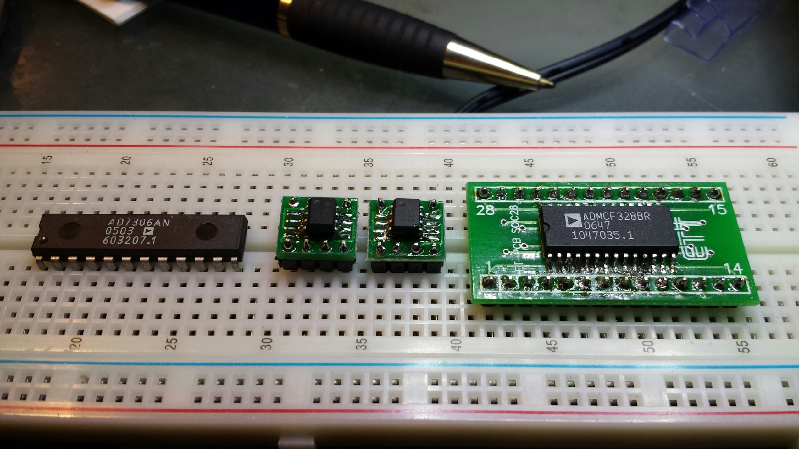

Setting up (slowly) for experiments with the ADSP 21xx based [ADMCF328](http://www.analog.com/static/imported-files/data_sheets/ADMCF328.pdf "Mitt 21xx") chips I grabbed of internet for cheap.
First step, set up to program them from serial line.
Based on the manual for the [ADMCF32X PROCESSOR BOARD](http://www.analog.com/static/imported-files/tech_docs/BoardF32X.pdf "The Manual") we need opto couplers between the RS232 line and the [ADMCF328](http://www.analog.com/static/imported-files/data_sheets/ADMCF328.pdf "Mitt flash") for some dang blasted reason.
So, rather than go feral, I pieced together the actual chips from the board from the time machine of the internet.
[caption id="attachment\_1445" align="aligncenter" width="450"] Let's not stray too far from the original - for now[/caption]
 
So, I will use my CPLD board to generate a 10MHz clk signal, rather than fiddle with a crystal.  For the moment I am going to go without the [NME0505S](http://www.mouser.com/ds/2/281/kdc_nme-34022.pdf "5Vto5V converter") although the mixing of analogue and digital gnd may be a little fiddly.  Although, this was inherited because I elected to go with the AD7306BR (an hence the opto couplers).   It may have made more sense to go with a MAX232 or similar.
The initial experiments will be LED lighting and driving my [LogicSniffer](http://dangerousprototypes.com/open-logic-sniffer/ "When a full logic analyser is not on hand") by the PWM pins.
