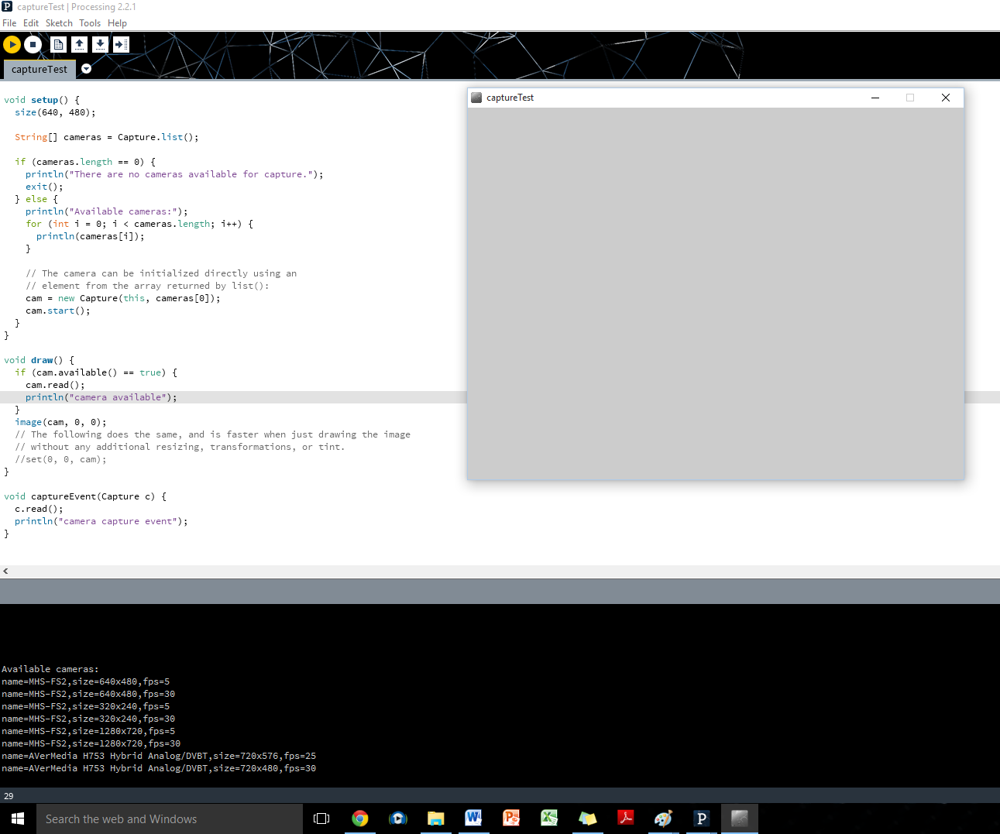
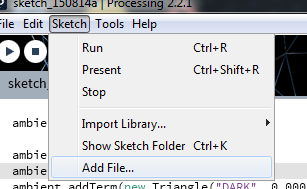
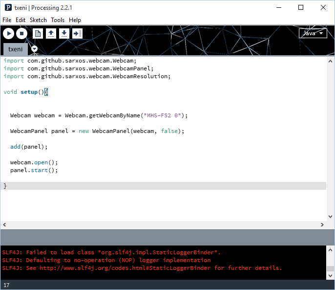
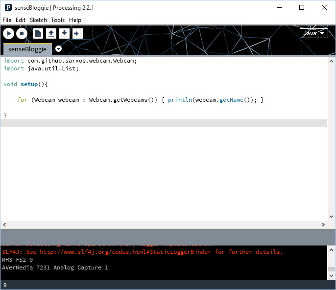

... when processing video library does not help.
Some webcams don't appear to work with Processing video library.
When you use the default example you will get the camera listed but it will never be available nor will it raise a capture event.
[](./processingvideo.png)
Having poked around, the solution I found was to go to:

```
http://webcam-capture.sarxos.pl/
```

Download: [webcam-capture-0.3.10-dist.zip](https://github.com/sarxos/webcam-capture/releases/download/webcam-capture-parent-0.3.10/webcam-capture-0.3.10-dist.zip)
From the zip file above unzip: bridj-0.6.2.jar, slf4j-api-1.7.2.jar
Grab the latest development jar for webcam-capture from [here](https://oss.sonatype.org/service/local/artifact/maven/redirect?r=snapshots&g=com.github.sarxos&a=webcam-capture&v=0.3.11-SNAPSHOT) as the one in the zip is missing the get camera by name function.  The jar at the link (when I looked last) was webcam-capture-0.3.11-20150713.101234-10.jar
Create a sketch and add all three jar to the sketch using:
[](./addfile.png)
Enter following code:
[](./helpt.png)
When you run it you should get a small window, or at least I did.
Replace my camera name with yours.  Mine is "MHS-FS2 0".
To find the name and index for you camera use the following:
[](./helpt2.png)
The camera name is your "camera name" + " " + "index".
Note the index will not necessarily be the same each time (if you have multiple cameras) as they might be found by system in different order each time you start up.
Multiple Java examples at author's websites at either:

```
http://webcam-capture.sarxos.pl/
```

or

```
https://github.com/sarxos
```

Note you get get the image with:

```
BufferedImage image = webcam.getImage();
```

But you will have to convert it to PImage if using Processing window thingies.
Suspicion is currently that one uses the [BufferedImage.getRBG()](http://docs.oracle.com/javase/7/docs/api/java/awt/image/BufferedImage.html#getRGB(int,%20int,%20int,%20int,%20int[],%20int,%20int)) method with the [PImage.pixels[]](https://processing.org/reference/PImage_pixels.html). This assumes PImage.pixels[] is an RBG array.  There is some example Processing code which seems to confirm this so fingers crossed.
