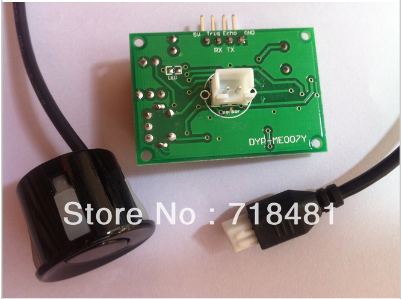

... please! Just one lousy ping.
[caption id="attachment\_1117" align="aligncenter" width="300"] Pinarrrrggggggggggggh![/caption]
Nope.
No ping, just some cycling rubbish that appears to interact somehow with delay between pings.  Zero returns mixed with occasional fixed value that does not fluctuate with distance of sensor from object.
Using the [newping](http://playground.arduino.cc/Code/NewPing) library was no help despite the author claiming that this gadget was one of the gadgets the library was tuned for.
Web search suggests multiple people trying and giving up on this gadget.
Might well do the same.
Pity, I thought, it might act as sonic bumper for my dive camera housing based submersible.

Back to drawing board.
