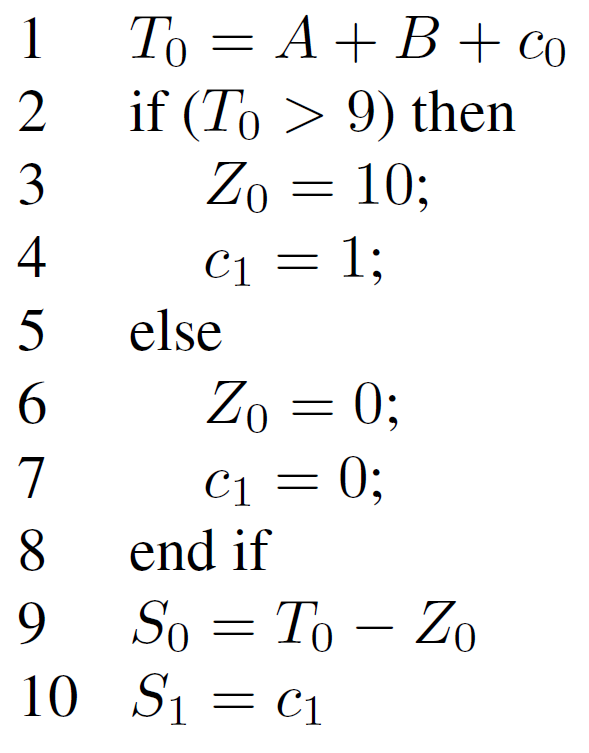
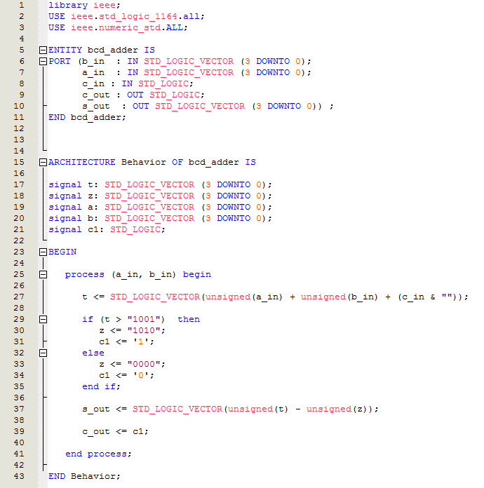

Not to mention the twists when doing math in VHDL.
Okay, I will mention it.
So dusting off the FPGA Labs from Altera University pack, recall we are working through Digitial Lab 2, in VHDL, to port it from DE0 or DE1 to  MASTER 21EDA BASIC CYCLONE II EXPERIMENTER’S BOARD!
I am currently up to Part V of Digital LAB 2 ... what? ... lay off!  I have been distracted somewhat ... get over it.
Any old how, the math thing.
Here is the problem.

The deal is that previously we were building a bcd adder by the numbers, using logic.  Now we are to build it algorithmically.  It is, however, more or less what the logic did.
Can't be hard right.  Just like programming.  BUT it isn't. Remember we are predominantly defining and wiring blocks of logic together.  In places, many many  places, we get what you might call in programming terms "concurrency" or "parallelism" because once things are wired together they can and will all send signals simultaneously if the layout permits.  All part of the problem of building logic circuits in VHDL or in Verilog.
The other thing is, being as we are building logic circuits, bits and vectors of bits rule Man!
So, it took a little work because we needed, firstly, to read into casting.  Some quirks came out, of course.
Short cut is the following VHDL code.  It compiles but I am still to debug so don't get too excited.  However, worth taking a pause.


So a few things first.  Many authors of \**cough*\* VHDL help will likely baulk.  There are some fashionable rules about how NOT to use STD\_LOGIC\_VECTOR, and adding is one of them.  The mantra is it's for bits and other "types" are for math.  Never mind we also have a STD\_LOGIC type in the carry flags!  (Well, we'll mind don't you worry about that.)

The thing though, we are learning and this brings out useful nuances to get your head around.  It did take a little time to click as one did have to read things once or twice ... or thrice.

The other side, I am trying to get re-use out of the infrastructure already built in earlier parts of the lab so the inputs out outputs are STD\_LOGIC\_VECTOR and STD\_LOGIC ... so there.

The types for a\_in, b\_in and c\_in are:

```
a_in : IN STD_LOGIC_VECTOR (3 DOWNTO 0);
b_in : IN STD_LOGIC_VECTOR (3 DOWNTO 0);
c_in : IN STD_LOGIC;
```

One thing to note, in all the scribbling out there, is that signed and unsigned are vectors so they can be cast to/from STD\_LOGIC\_VECTOR.  A good explanation is at [bitweenie](http://www.bitweenie.com/listings/vhdl-type-conversion/).

So, end result is that the following worked:

```
t <= STD_LOGIC_VECTOR(unsigned(a_in) + unsigned(b_in));
```

The following did not work:

```
t <= STD_LOGIC_VECTOR(unsigned(a_in) + unsigned(b_in) + unsigned(c_in));
```

Similarly the following did not work:

```
t <= STD_LOGIC_VECTOR(unsigned(a_in) + unsigned(b_in) + c_in);
```

It took some head scratching but the line that worked was:

```
t <= STD_LOGIC_VECTOR(unsigned(a_in) + unsigned(b_in) + (c_in & ""));
```

The gem, of course, was the (c\_in & "").  The ampersand or & is a concatenation operator in VHDL.  So, you are building a vector of one or, say {c\_in} as opposed to c\_in.  That is the "" is an empty vector so an empty vector plus an entry is a non-empty vector of one entry.  Think of vector then as array.  A good explanation, with examples, is on page 41 of a tutorial on VHDL by Peter [Ashenden](http://ati.ttu.ee/~alsu/VHDL_TUTORIAL_Ashenden.pdf).

 The line I am dubious about is:

```
s_out <= STD_LOGIC_VECTOR(unsigned(t) - unsigned(z));
```

I actually curious whether I need to use signed instead, so a little thinking still to do.

Not to mention the idea that if I make z (4 DOWNTO 0), instead of (3 DOWNTO 0), I naturally get a carry bit without having to have the extra signal and so I likely can do something like this:

```
c_out <= z[4];
```

Meaning I can get rid of some of the intermediate signals.  We'll see.

Still poking around.

Oh yeah.  It is in a process block because it has to be sequential, like a program, and not a bunch of wired up logic.  That is that other twist you need to remember.
