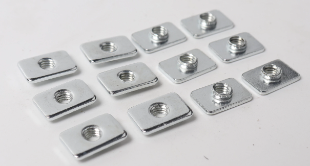
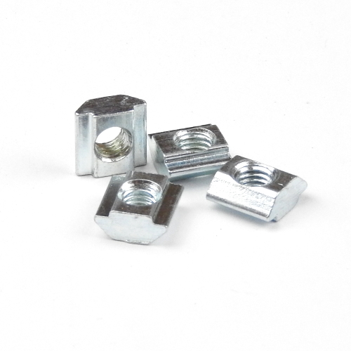
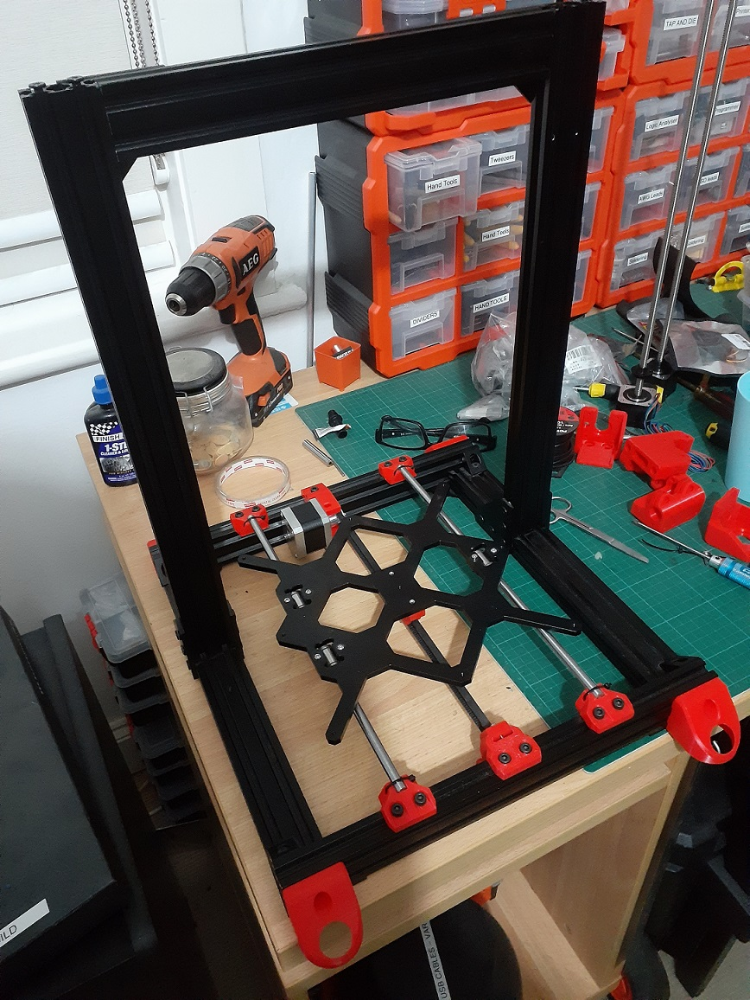

So, stalled again ... FRACK!

Heaps of M5x8mm, M5x12mm, but I did that on the cheap - by buying n packets of mixed bolts from Aliexpress. Now I understand that'll offend some, but I'll not lose any sleep over your angst (this is the emoji for "your angst >🤯<).

Not to mention, I got a packet of what was supposed to be M5 "t nuts" but they did not match with the M5 bolts I had, or at least 2 did and a random check of ...

.... *WHAT THE FRACK IS THE PROBLEM WITH THESE NUTS!* ...🤬

... and did not find any more than the two 2 that fitted, oh I didn't find more than the 2, I didn't find more than the two that I fitted, and it really did made me feel really blue!

These nasty suckers! Not for my Bear Build no more AND, yes I hear you ... WHY WOULD YOU?!?!?

Ordered some of these locally, to get them quick, and another batch from Aliexpress, to keep the stock up.

So, yes. Stuck at exactly at Figure 1! below. The "missing" [M5x10mm are for the Z-axis motor mounts](https://guides.bear-lab.com/Guide/06.+Z+axis+motion/47?lang=en#s570).

So, really the first step of the Z-axis build ...

... GOD FRACKIT!!

The "feet" I have added [take squash balls to provide a cushion](https://www.thingiverse.com/thing:3385254). Just do a search of Thingiverse for feet options.

Figure 1
