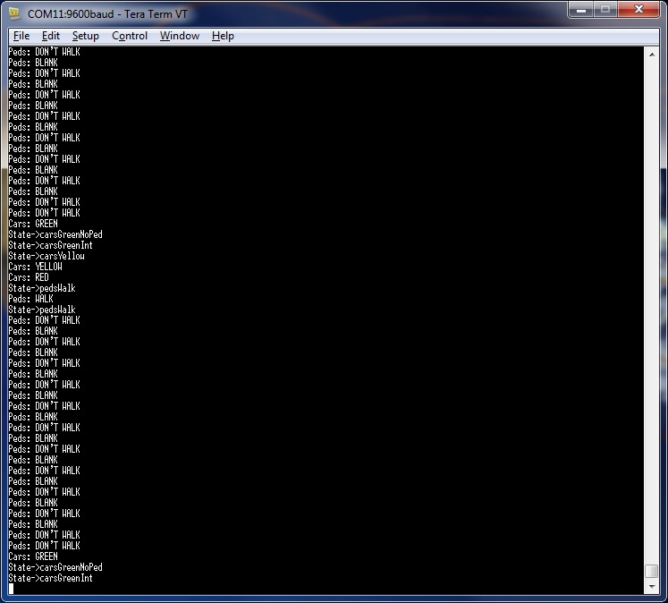

At home recuperating after surgery, so I can spend a couple of hours sitting tinkering so I don't go stir crazy.
Previously I mentioned I got hold of a DFRobot Bluetooth dongle for my DFRobot Romeo (All-In-One).  It decided to try the basic example to see if the bluetooth dongle on my laptop would work with it.
The usual trips and stumbles.  I had upgraded to 1.0 of arduino.cc and forgot to set the board type properly then had to discover buried in the narratives the reminder to take the Bluetooth dongle off the Romeo when programming as it clashes with the onboard USB ... yadda.
The only nuisance then was the built in terminal in the IDE which is a bit clunky.  I got around this with a download of Tera Term VT.
The final hurdle was the need to manually connect to the COM port despite having set the flag for auto-connect.
So, more (or less) a plug-n-play.
The Pièce de résistance, I bombed the Romeo with the Dining Philosopher's example from the [QP site](http://www.state-machine.com/arduino/index.php "QP Site") (using the event driven kernel for the Arduino) ... viola!  Bluetooth serial works with RT event driven kernel.

Next step will be to get a connection going with one of the Android gadgets using [Amarino](http://www.amarino-toolkit.net/index.php/home.html "Amarino toolkit").

PS.  On a hunch I went looking on the Android App Market and (sure enough) I have downloaded a couple of bluetooth terminal programs to see if I can use the tablet instead of the laptop for some of the terminal driven experiments ... stay tuned.

PPS. Yeah HA! er, sorry.  Paired my Acer A500 with the DFRomeo running with bluetooth dongle and within a couple of seconds was able to control the app running on the Arduino with the tablet through BlueTerm.  Unlike the laptop, the tablet autoconnects and stays connected even when tablet goes to sleep - whereas the laptop would drop the connection when sleeping and require the nuisance manual connection when awoken.
