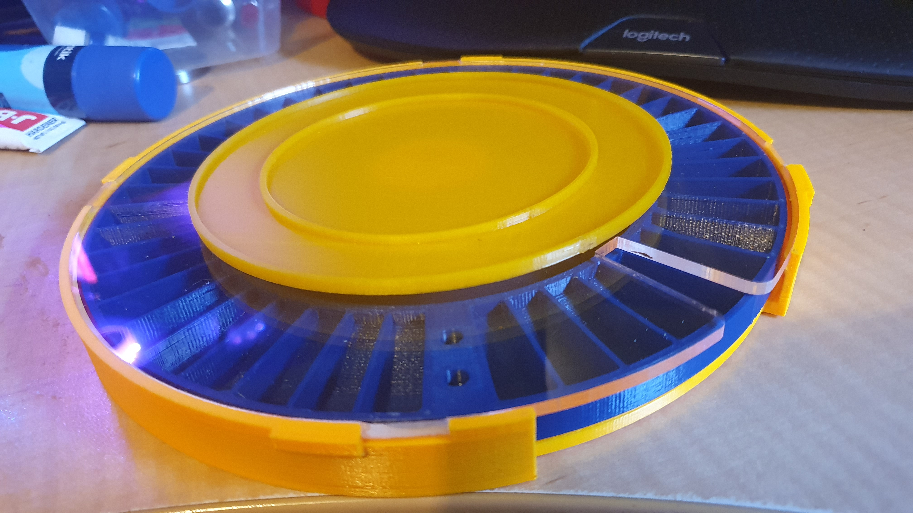
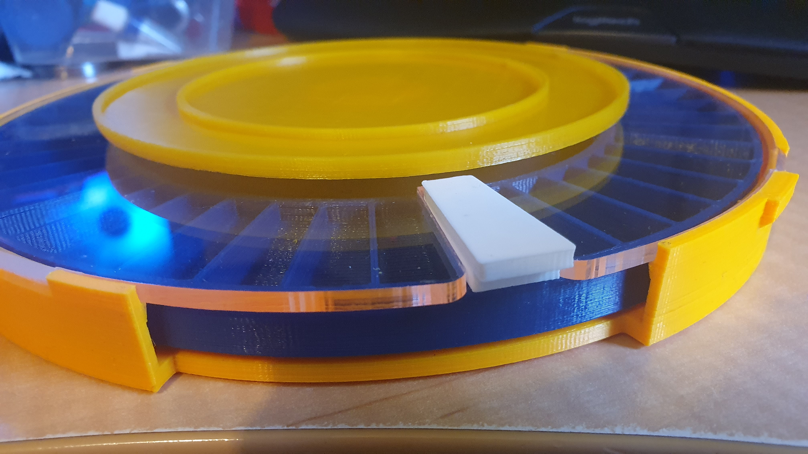

Last step is the rubber mat in the middle. I will need buy a sheet of sticky backed rubber sheet from Bunnings. The approach by the original author was to 3D print a cutting guide and then use a knife to cut the rubber. Why, who knows, as if you have a laser cut perspex lid you can laser cut a thin rubber sheet. So, just now waiting on makerspace to reopen after Christmas and I'll laser cut the rubber mat.

Now isn't physics wonderful. The apparent difference in colour between the base and the assembly tray is the blue turning the assembly tray a slight green, since the tray is thin. Yes, that actually bugs me. My fault, I was trying to break out of me habit of black and red for everything.

Oh yeah! Forgot, I had already printed the locky thingy for when storing the loaded tray. I'm sure the "funnel" I printed will turn up, ... , eventually.

