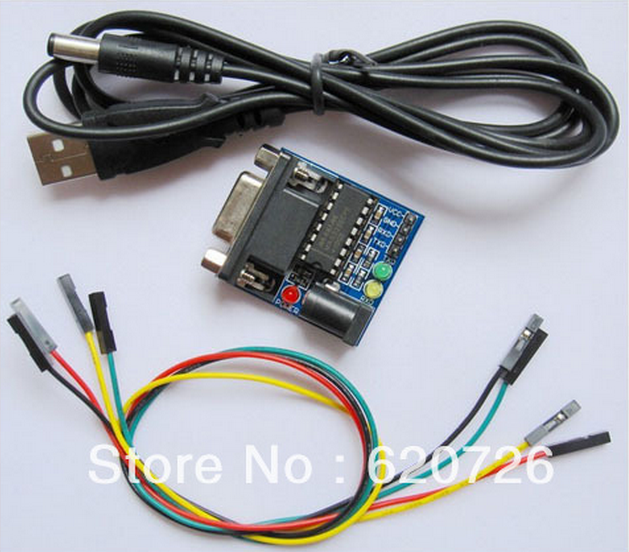
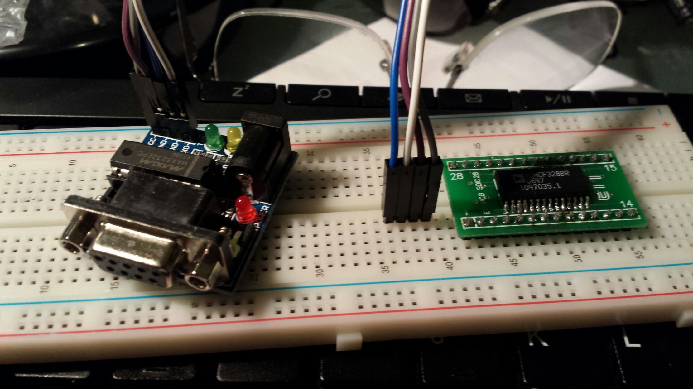

So, a little birds nesting and a lot of fiddling convinced me from moving away from the [AD chip with opto-couplers](http://organicmonkeymotion.wordpress.com/2014/06/29/getting-there/ "Getting there").  So, I went for a MAX232 after all, with benefits.
[caption id="attachment\_1472" align="aligncenter" width="300"] Why not?[/caption]
So the setup for the ADMC32x is now:
[caption id="attachment\_1473" align="aligncenter" width="300"] More sensible[/caption]
The other side is this module is more useful as I can use it on other experiments.  The other way was too sensitive to bumps and knocks and I need a "quiet" interface because the problem is working out whether I am getting code onto the chip - and not whether my birds nested serial interface is up or not.
10MHz clock is still coming from MAX CPLD.
