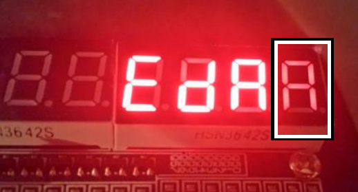

Okay, so I set myself a task to discover why I was getting ghosting in the display for Part VI of [LAB 1](http://organicmonkeymotion.wordpress.com/2014/06/30/vhdl-digital-logic-lab-1-cont/ "VHDL DIGITAL LOGIC LAB 1 Final").
The black and white box shows the ghost "A".
[caption id="attachment\_1464" align="aligncenter" width="300"] ghost[/caption]
 
This would be that the segment signals were not changing until after the display enable - carrying over the previous character for a short time before the blank is drawn.
Now this, in the un-registered approach, is plausible.  It means the signal paths for the segment drivers are longer (somewhat) than the display enables.
Bugger is, to date, I have failed to get a registered version working.
Of note, I used Fizzim to create a Verilog and a VHDL state machine to try driving the displays to find the same state machine input gives a Verilog soluton that generates rubbish (despite reading as if it should work); and a VHDL version that currently doesn't clock, and so just shows the second character but reacts nicely to button input.
So, I decided to fire up ModelSim, which comes with Quartus, to see if the simulator would spread any light on the subject.  That will take a little time to sort out as the simulated version of the code that works (but ghosts) never seems to generate outputs, though I can step through the sweep generator fine.
I may get lazy and just use my LogicSniffer for the moment - at least to test the theory of the lag between the segment and display enables.
Fingers crossed.
I will put together the whole story once I have worked it out.
