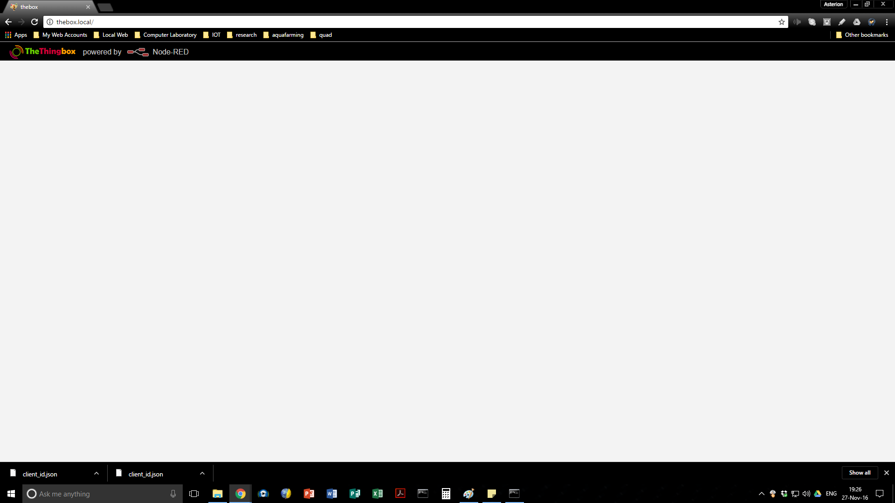

The RaspingBreathBurry my mate gave me, though I appreciate the gesture, I can sense his reason was as it is such a slug.
I FINALLY seem to have 2.4.o of TheThingBox sluggishly wasting bit traffic on my lan.
5 minutes of "busy" gadget spinning and it managed to display the red-node title bar but it did not draw gadgets, or canvas, or properties panel.
I think I will have to press a precious ODROID C1 into service.
[caption id="attachment\_2910" align="alignnone" width="1920"] What a waste of a Sunday Afternoon![/caption]
The Google Calendar that comes out of the box with TheThingBox may be a knobbled version of the node-red-node-google suite.  Go figure then, as the 2.4.0 of TheThingBox includes the 0.15.2 update it has a palate manager.  Yes, you guessed it, as hard as I tried to update the palette with node-red-node-calendar it would not install.
That might have to do with nodes from ttb-node-google-calendar in use.  Who knows.
Certainly you cannot remove a palate if anything off the palate is on a canvas.  So I cleared of the canvas to un-ghost the "remove" button for ttb-node-google-calendar and ... yes, you guessed it tens of minutes later the "busy" gadget is still ticking over.  So, I may not be able to clear out the unwanted palate nor add the node-red-node-google palate to the RaspingBreathburry.
POST SCRIPT
So painful.
So, I jumped on the bike sitting on its trainer and span for half an hour while letting the "busy" gadget spin.
Came back ... doh!
I found the palette up again and thought someone was finally smiling down on me.
I spent another couple of hours with spinning "busy" gadgets, thinking about how my Grand Father used to fix everything with a 5lb sledge hammer and an angle grinder, and what a lovely gesture of remembering those times with him it would be if I took a 5lb sledge hammer to this useless RaspingBreathBerry.
Eventually, after a reboot or three having tried fruitlessly to either remove or disable the ttb-node-google-calendar and install the node-red-node-google palate, the expected nodes were in the palate.
So, I sheepishly added a calendar object and YES! it was the node-red-node-google calendar.  So I went to register it and ... kaput.
Long story short the google api won't accept  http://thebox.local/google-credentials/auth/callback as the callback.
I assume then that is why the ttb-node-google-calendar nodes were created??? Who knows, they wouldn't connect, the node-red-node-google nodes wouldn't connect.  Since there is no real documentation in and around that ttb junk the canned TheThingBox seems to be no help.
So we are back to setting up an ODROID C1.
Before that I will try the red-node I have running on my ODROID-W as I had not upgraded that yet nor have I used the google gadgets on it.  It was handbuilt using node.js, npm etc.   I also was using  [emqttd](https://github.com/emqtt/emqttd) instead of mosquitto so it might as well be a handbuilt system - it actually took far less time to set that up than to try to track down the problems with the RaspingBreathburry.
Certainly after the 5 minutes it took to sort out node-red-node-goggle connection to api and getting my calendar to ping the node-red on my PC, the nuisance in and around TheThingBox approach still needs work - but not from me.
