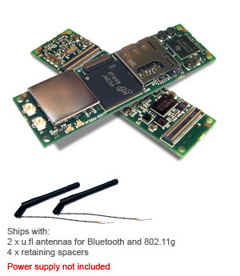
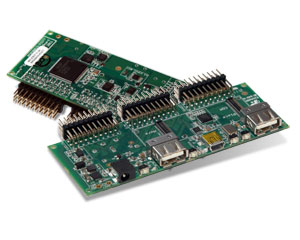
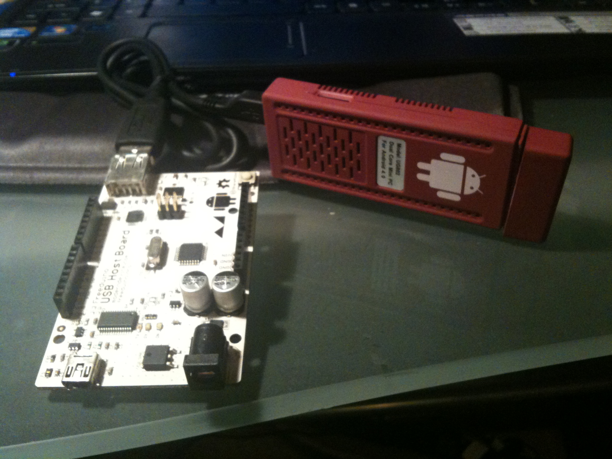

**GUMSTIX (the old way)**
I had been holding off on buying a [gumstix](http://www.gumstix.org/ "there was a time") because they are quite expensive for the horsepower.
Cheapest entry level (with wireless) to get I/O for robotics would be:
[[](http://organicmonkeymotion.wordpress.com/2012/10/04/gumstix-killer/gum3503a-overview-2/)](http://organicmonkeymotion.wordpress.com/wp-content/uploads/2012/10/gum3503a-overview.jpg)
Overo® Air COM at US$200 plus say RoboVero™ at US$100 (***US$300 all up***) or with Alcatraz™ US$59 (***US$259 all up***).  You can pop Linux onto the thing - good - and I understand you can sneak Android onto it - very very good.
Grunt is provided by Gumstix is:

* Architecture ARM Cortex-A8 Processor Texas Instruments OMAP 3503 Applications Processor ***600 MHz*** RAM 512 MB NAND 512 MB

***GUMSTIX KILLER (the new way)***
Now, look what I put together for ***US$150 all up*** ...

The red brick is:

* Dual Core Cortex-A9 ***1.2GHz*** UG802 Mini PC, Android4.0 Dongle, TV Box, HD IPTV Player, DDR3 1GB and that is a Freeduino USB Host for I/O.

Now the Android comes pre-installed (no stuffing around) and there is still a card slot.  Of course, it hasn't got the camera and sensors of a phone but who cares if you are attaching a 9DOF board and pumping the video through a FPV system.   I can always use one of the cheaper phones with camera to pump a video stream using one of the video streaming apps.  But then again, Gumstix is sans all those things without additional add-ons.
Of course, if you paired an IOIO and a single core android mini pc you could get in at ***US$83 all up***, but all you'd get is:

* MK802 mini pc Android 4.0 Allwinner A10 ***1.5GHz*** Cortex-A8 (twice the grunt of a gumstix) for ***US$33!!***
