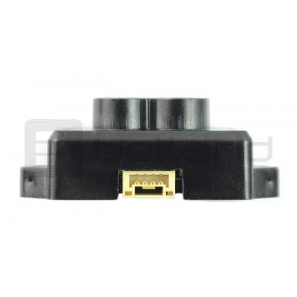

So, mislaid the cable from my Benewake TFmini Micro Lidar.   What on earth is this socket type please?  Anyone?

POSTSCRIPT
I pinged 3XDR, from where I got the gadget, for a hint as to the connector type. He is kindly sending me one!  Otherwise, it's a JST-GH 4-pin.  Used in pixhawk.
POST-POSTSCRIPT
All good.  New cable on hand. I have the gimbal board too, and a 4 core slip ring, so just waiting on the gimbal motor (with the large bore).  To give a keyed position I have a line sensor so I will add a reflective line to the gimbal motor spindel.
