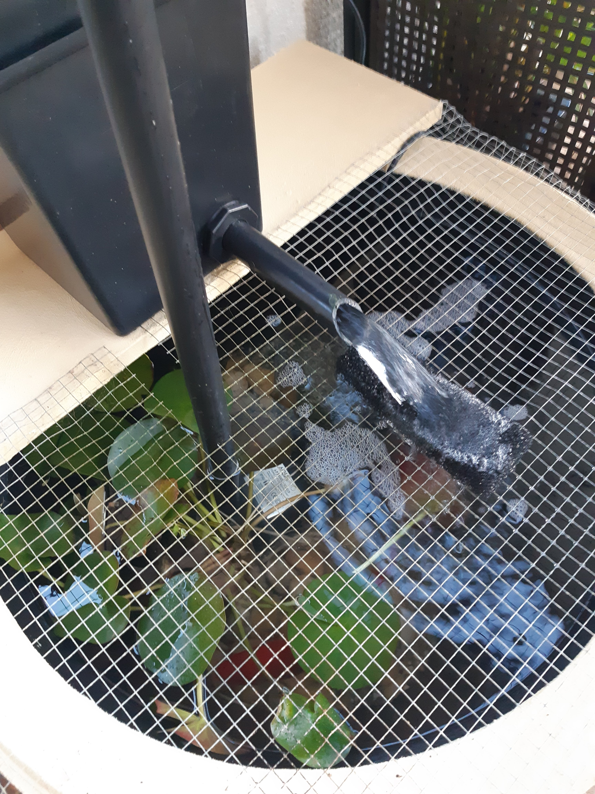

I was umming and ahhring about getting a aerator for the pond, or at least using the one from the retired pond.

No need.

I noticed a plume of air bubbles, driven almost to the bottom of the pond, by the water streaming through the course filter foam sitting on the wire. The foam I was using as a muffler also acts as an aerator!

Don't forget though!

You need condition the pond weekly, so remove a bucker of water (around 13% of pond is the rule) - it's good for the plants around the yard. Top up. Clean out filter once a month.
