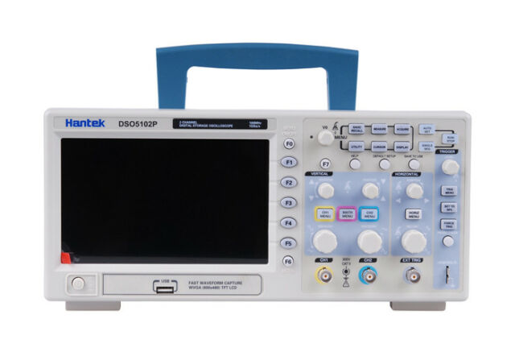

So, the wife was pestering me to give me hints as to what I wanted for Christmas.

I have a workshop full of stuff. I had recently bought myself a dual adjustable power supply, so what does one really need.

I shrugged my shoulders and said, an oscilloscope I suppose. She said sure, what is that? I explained it, trying to make it sound necessary. It was, sort of, because I am trying to buzz out the problem with the pesky power conditioning on the opensprinklette boards - the solenoid for the sprinkler causes a brown out in the ESP8266 board.

Sure she said.

What I said?

Sure.

So I immediately ordered a Hantek DSO5102P from Aliexpress. It was in an in country warehouse and is now just today, the day before Christmas, wrapped (by me) ready for the Wife to hand it to me tomorrow.

I will need feign surprise.

