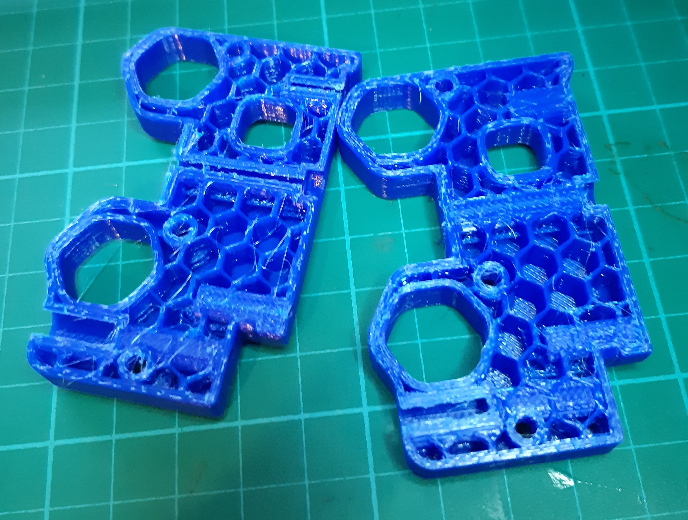

So I decided to play it safe, so as not to have to disassemble the PnP machine to try out different x-axis designs - when its solving the z-axis design that is actually (or should be) the focus.

As previously mentioned. Opted to use the VORON Legacy x-carriage as the basis for my PnP x-carriage, rather than re-design the lot. I will play with a drop in magnetic seat, for attaching the z-axis - as well as just attaching directly.

Whether the magnetic tool could weather the mechanical loads is still unknown.

https://www.youtube.com/watch?v=wSXvcveNSTQ

... WHAT THE FRACK!?

WHAT' UP WITH THAT!?

As above though, having problems printing with my FlashFinder Forge (again). Stops pushing through filament at some point (almost the same point these two runs). No sign of blockage as getting it going again was just a matter of restarting.

There were a few fails also getting other runs to take to the bed, but re-levelling found no problem with levels. Had run out of gluestick, so off to OfficeWorks to [buy up a bulk pack](https://www.officeworks.com.au/shop/officeworks/p/studymate-blue-stick-35g-5-pack-sm3500dbpk). Print happily sticks to bed now.

There was an odd thing with the filament, when I tried a run that didn't produce any filament. I opted to run a load to test the filament extrusion, jiggled the filament to find it was running through the extruder so that was odd, because it was if it had backed out some. There was again no blockages.

On a run now, fingers crossed. So I am waiting on that. I may need pull the printer apart and check the extruder. Something may have come loose after my last reassemble.

Still have a few sprints left on my [Bear Build](https://organicmonkeymotion.wordpress.com/category/bear-build/), and then still the setup pains for that, so plodding on.
