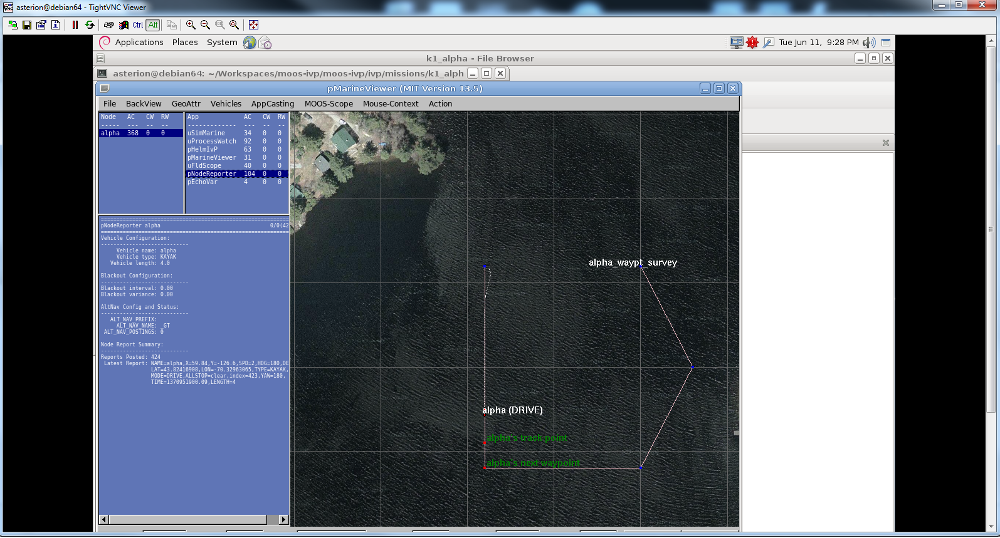

[MOOS-IVP running!](http://oceanai.mit.edu/moos-ivp/pmwiki/pmwiki.php?n=Main.HomePage "Autonomous framwork for UUV et al")

This is running on my new (second hand) [64-bit LINUX box](http://organicmonkeymotion.wordpress.com/2013/04/16/64bit-linux-box-in-my-boot/ "64bit linux box in my boot").
This is stage 1.
Stage 2 was to buzz out my Beaglebone development environment.  So far I have installed Eclipse and the ARM7 development environment onto the 64 bit LINUX box and built a small binary to dump onto the Beaglebone.  Unfortunately, I don't appear to be able to configure the LINUX host to "see" the ttyUSBx ports (having tried two different approaches).  So, waiting on user group help ([and you know how I feel about that](http://organicmonkeymotion.wordpress.com/2012/07/01/unwanted-side-effects/ "MSN, User Community, and that joke about the hot air balloon")).
In the meantime I guess I still have to sort what parts of MOOS-IVP I wan't to run on the Beaglebone (no-visual apps generally) so I got the thing running my my LINUX host to get a feel for what can be parred back.  Might try setting up my [32 bit LINUX](http://organicmonkeymotion.wordpress.com/2013/01/01/xmas-holidaze-bad-ubuntu/ "Xmas holidaze – bad Ubuntu") box to "pretend" to be the embedded environment to get the ball rolling while I sort out the cross-compilation environment.
The MOOS-IVP runs as a separate environment to the vehicle computer so I am paring it up with an AIO which will do all the motor control and the 10-DOF sensing etc.

The code for the AIO (from a port of AP2) is MAVLINK literate so I am thinking of bridging to AIO via Python (which comes with the Beaglebone).  There are various Pythonesque libraries I am toying with for application backbones including [SPADE2](https://github.com/javipalanca/spade "Agents in Python"), [ZeroRPC](https://github.com/dotcloud/zerorpc-python "Remote Procedure Calls") (which is atop [ZeroMQ](http://www.zeromq.org/ "Zero meaning the very least overhead")), [iPOPO](http://ipopo.coderxpress.net/ "iPOPO is a service-oriented component model (SOCM) framework for Python") OR even a combination of all three depending on needs.  Certainly, I am looking at ZeroRPC to act as a bridge out to the [Synapse SNAP bits and bobs](http://organicmonkeymotion.wordpress.com/2012/08/05/the-full-history-of-the-synapse-debarkle/ "My run-in with Synapse and SNAP") since the MESH of SNAP will replace the MAVLINK mesh aspects.
