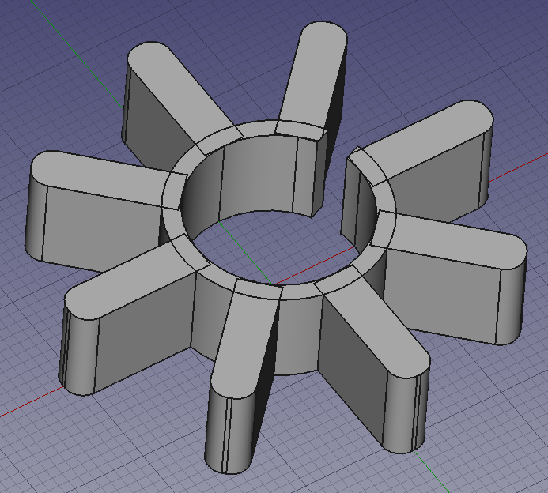
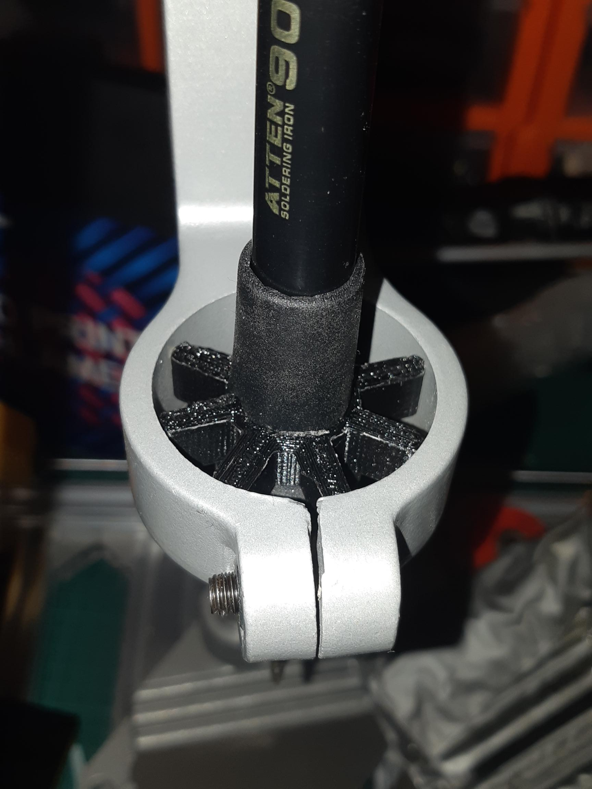
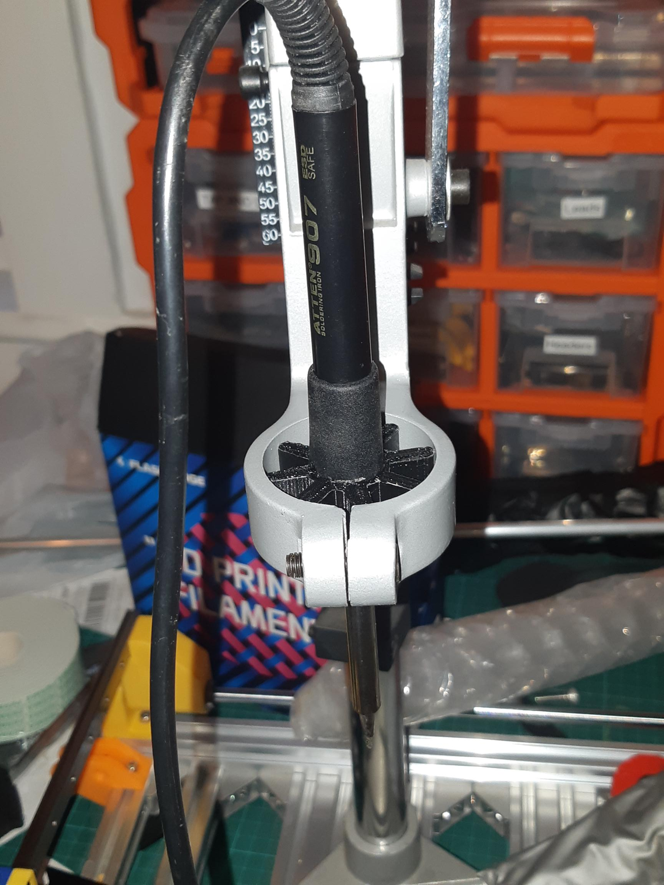
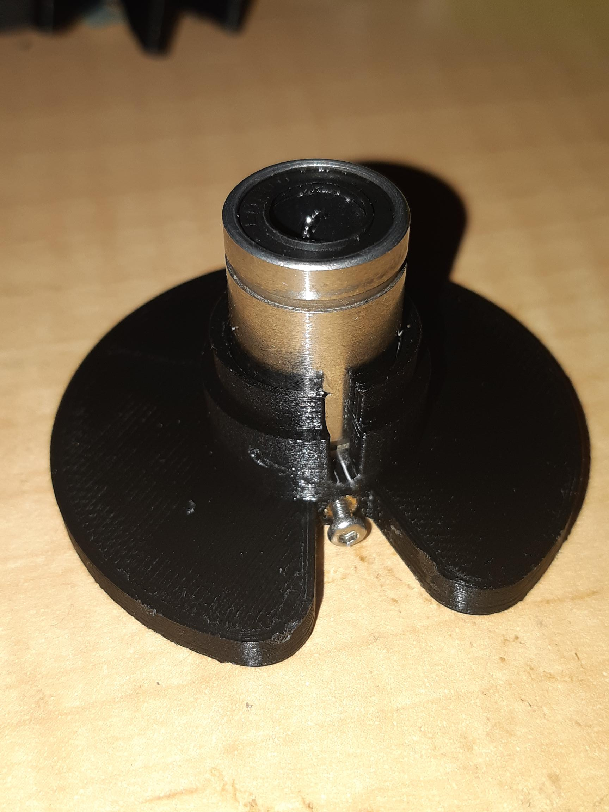
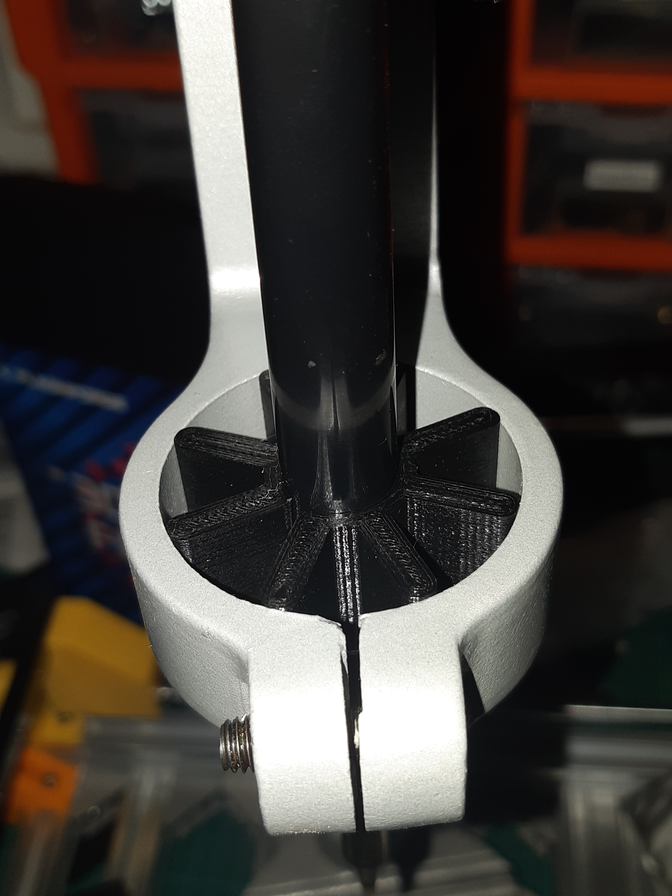
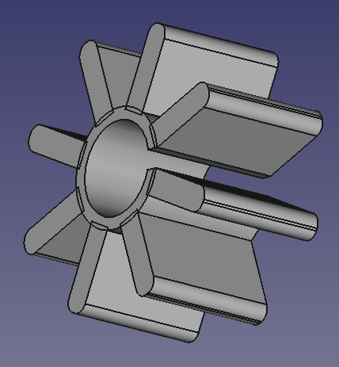

Figure 1

[Multiple ideas for DIY heat set presses](https://www.google.com/search?q=diy+heat+set+insert+press&rlz=1C1CHBF_en-GBAU863AU863&sxsrf=AOaemvJg2Q0NxY4Nao8RR5jvzmNw6NUMgw%3A1637393351581&ei=x6OYYfbpIuniz7sPsaez6Aw&ved=0ahUKEwi26c_Itab0AhVp8XMBHbHTDM0Q4dUDCA4&uact=5&oq=diy+heat+set+insert+press&gs_lcp=Cgdnd3Mtd2l6EAMyBwgAEEcQsAMyBwgAEEcQsAMyBwgAEEcQsAMyBwgAEEcQsAMyBwgAEEcQsAMyBwgAEEcQsAMyBwgAEEcQsAMyBwgAEEcQsANKBAhBGABQAFgAYN4OaAFwAngAgAEAiAEAkgEAmAEAyAEIwAEB&sclient=gws-wiz). [Closest thing to my needs makes an adaptor for a drill press](https://fixturfab.com/articles/diy-heat-set-insert-press/).

As I have a drill press from Jaycar, thanks to an XMAS gift card, I only need make an adaptor for that to hold one of my soldering irons.

There were problems with the drill press option I found. It didn't fit my soldering iron and didn't make sense in terms of needing a compliant mechanism to respond to tightening of the ring holding the insert.

So Figure 1 is a cube, with chamfers, polar rotated, and then welded to a hollowed cylinder and a notch cut out to turn it into a compliant mechanism.

Figure 2

Figure 3

RE Figures 2 and 3, ready for work! I have a M3 heat set tip bought locally, as a full set I had ordered got returned to vendor in US, when USPS cancelled shipping to Australia. I have again ordered a full set of tips, hopefully they'll get through this time.

I had to hand set a pesky M2 heat set in my prototype SMT cover tape collection spool (Figure 4). Not a bad job. Ignore the metal LM8UU, as I have a batch of nylon one's still coming - since I need to trim them to fit the 8mm version especially. This one is knocked up to trial the break setting. It will otherwise have a M2 grub screw in the final versions.

Figure 4

In the end, I needed second pass over the design. Firstly, the soldering iron has a rubber sleeve for user comfort. It comes off, and it may well need to, so as to allow a tighter grip on the iron. I will likely build a power supply for my 5 pin irons ([that turned up in error](https://organicmonkeymotion.wordpress.com/2021/05/31/now-i-cant-count/)), as the one in the photo is my spare 7 pin iron. The other tuning would be to make it longer than the 10mm currently.

Figure 5

So, Figure 5 show's a snug fit, after the re-design. The CAD tool is handy. The sides of the handle are not parallel, so a cone worked a treat as the binary cut. All dimensions spot on. Snug on soldering iron handle. Slipped into press. A few turns of the hex screw of the press and we've a good tight fit.

Figure 6 then is the final model. You can't see the cone (there was 0.3mm diameter in it but worth it). Now 21mm high. So, there is no movement now when mounted. When leaving the rubber grip in place, the thang wobbled, obviously because the rubber allowed for movement.

Figure 6
