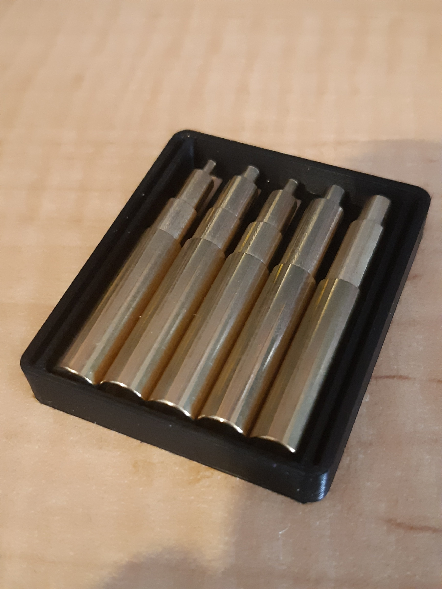

Paid through the nose for a full set(ish) of heat set tips (Figure1).

Figure 1

That's how they come. Not a snug fit on my Atten 907 (Hakko clone) 5-PIN irons - [that turned up in error](https://organicmonkeymotion.wordpress.com/2021/05/31/now-i-cant-count/).

Good snug fit with my genuine Hakko 907 7-PIN irons. Is it really genuine? Long dropped from their product line. Any old how, snuggly.

I may need hack a quick 3D printed sleeve to hold the tips in the tray supplied.

This was the second attempt to get these in. First attempt failed. I ordered from the US and months later a refund popped into my account. A quick check and it was the period when the USPS, in contradiction to the trade agreements with Australia, and just when the DoD wanted Australia to buy their nuclear subs, that USPS pissed off Australia as being too tricky to deliver parcels to - probably USPS using the bloody [wrong map](https://www.abc.net.au/news/2020-08-02/theres-no-such-thing-as-upside-down-world-map-racist/12495868).

So, if you need translation, "pissed off" can be taken in either of two ways. First, they, USPS, aggrieved Australians. Second, they, USPS, dropped Australia off their routes. Funnily, both apply in this case, so as to become a double entendre. And we do like double entendre.
