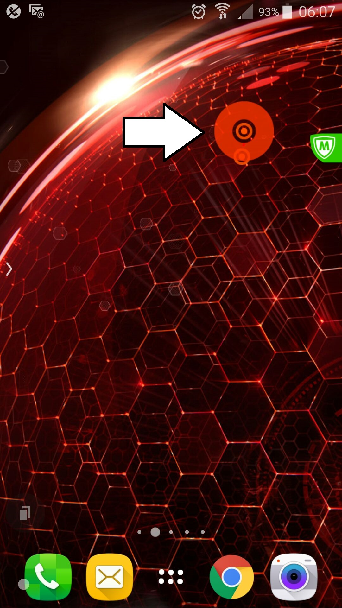

Why have I strange red circles now on my Android desktop?
Just floating above everything.  Not reacting to anything?

POSTSCRIPT
So, didn't work out what caused it.  A phone reset cleared it.
I had Planet's Position app running at the time (the thing almost looks like a planet orbiting doesn't it).  However, I uninstalled the app and reinstalled it but the circles did not appear again.  So, likely too much going on to pin it down to one thing or the other.
