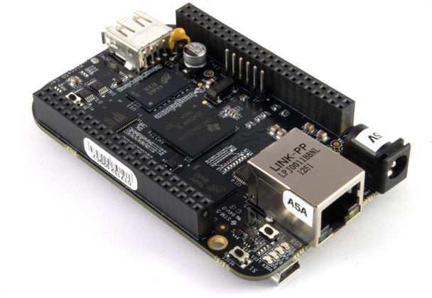
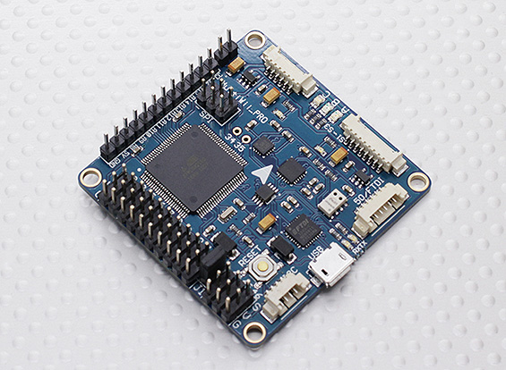
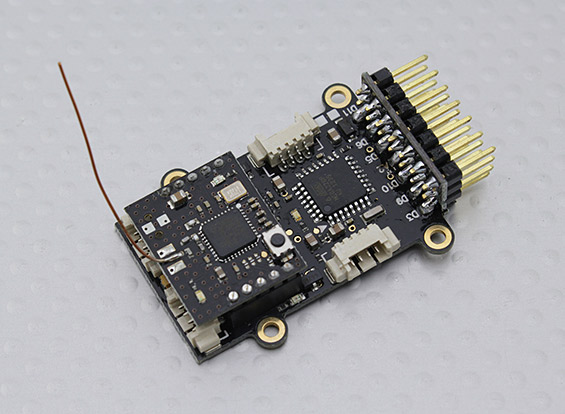

... straight forward really.
[MOOS-IVP](http://oceanai.mit.edu/moos-ivp/pmwiki/pmwiki.php) happily compiles and runs on on of my [Beaglebone Black](https://beagleboard.org/black)s.

Sooooo, no stretch (pardon the pun) for MOOS-IVP to fit onto a [C.H.I.P.](https://getchip.com/pages/chip)!
 
Both are 1GHz processors with 512M of memory.
The standard approach, in any event, is run MOOS-IVP on the linux board and have an arduino interfacing with the hardware.
Of course, I am running against the AIO:

You could just as easily run against a raft of other boards, such as:

Or even a Parallax Propeller board!

That would all depend on what you are offloading to the hardware layer.
