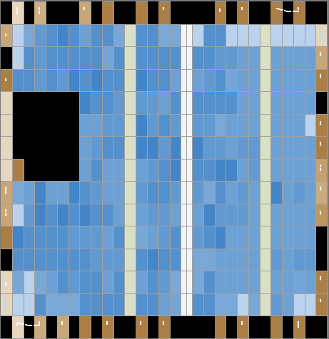
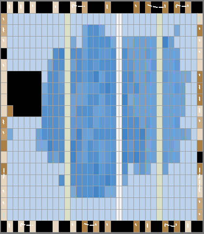

Forth in hardware on FPGA!
So, of all the options found [uCore](http://www.microcore.org/ "Not a bad version") seems best as it compiles on my [EP2C5T144C8](http://www.aliexpress.com/item/Free-shipping-ALTERA-FPGA-EP2C5T144C8N-fpga-board-USB-BLASTER-fpga-development-board-fpga-altera-board/793643076.html "Tight squeeze"), voila!:
[caption id="attachment\_1500" align="aligncenter" width="290"] Oh so squeezy![/caption]
So only just.
However, this board has no RAM et al so not a lot of point (since you need external RAM and ROM (so-called).
However, on my [bigger Altera Cyclone II board](http://www.aliexpress.com/item/Free-shipping-ALTERA-FPGA-USB-Blaster-LCD1602-USB-TTL-EP2C8Q208C8N-fpga-board-fpga-development-board-fpga/1389939909.html "Not as squeezy") it has room to spare (a little) and RAM et al on the board (no ROM but I will have to sort that some old how).  Here is the map:
[caption id="attachment\_1501" align="aligncenter" width="261"] A tad more room![/caption]
There is a config file (more or less, a constants file) that allows you to tune the CPU so I will look at what that might do for me.  However, first thing will be to sort out a blinking light app.
