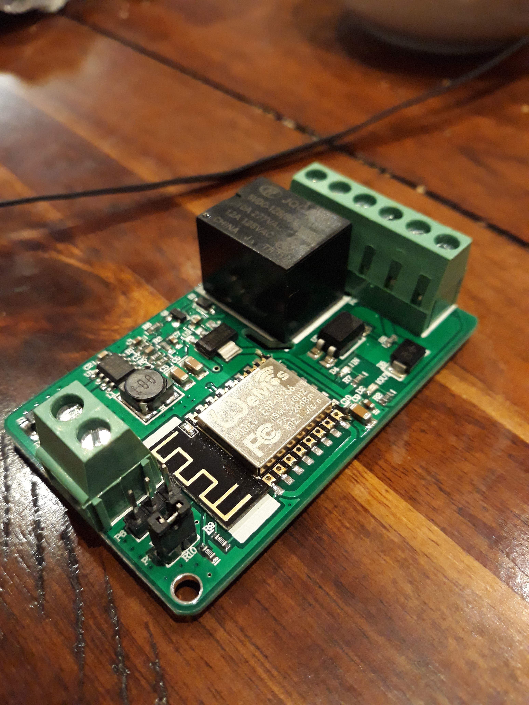

If you are using a module such as the one pictured below, to drive a single sprinkler solenoid, then you will note it will accept 7-30VDC in. So you will need a AC-DC conversion. A bridge and a 1000uF cap will do. If you are wanting something neater then [aliexpress comes to the rescue with a kit option](https://www.aliexpress.com/item/32849474682.html?spm=a2g0o.productlist.0.0.bbc97843mhDiZk&algo_pvid=1ad0d1b0-437e-48b8-a88e-8d954c028427&algo_expid=1ad0d1b0-437e-48b8-a88e-8d954c028427-4&btsid=ff115ac1-d55a-4842-b0e7-287732cafc8b&ws_ab_test=searchweb0_0,searchweb201602_3,searchweb201603_53).

