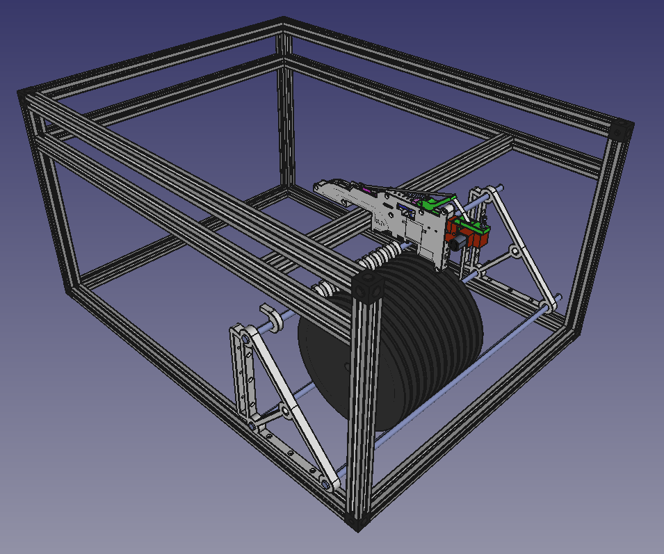
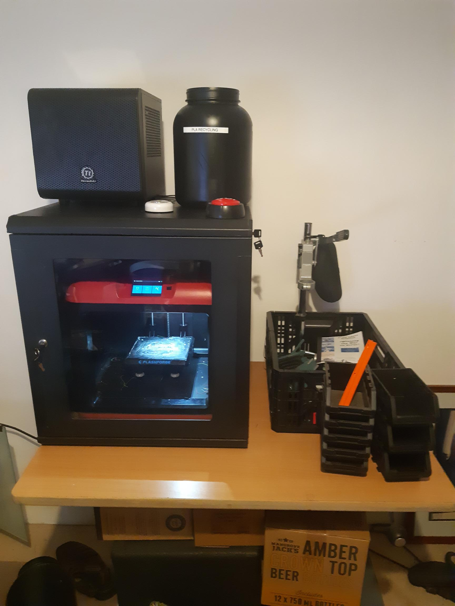

Figure 1

So Figure 1 is opting for 640x490x340mm size, so 600, 450, and 300mm standard extrusions. Not "small" per se. Small working area of 310x310 using the corexy over the 450x450 inner dimensioned "box" that the extruder is jutting into. Everything is then "internal".

The bonus?! This is by width and depth EXACTLY the space left on the bench I have my 11U cabinet, that houses my FlashForge Finder, per Figure 2.

Figure 2
