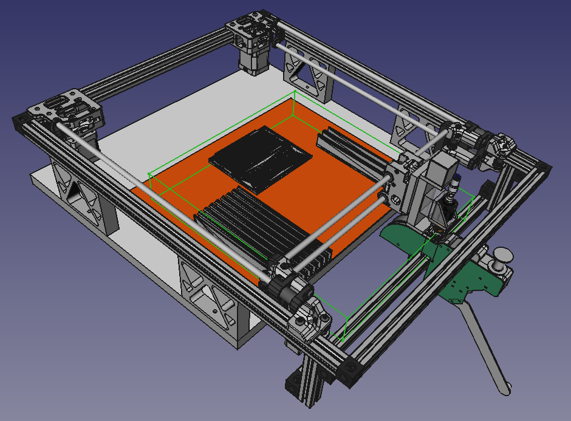
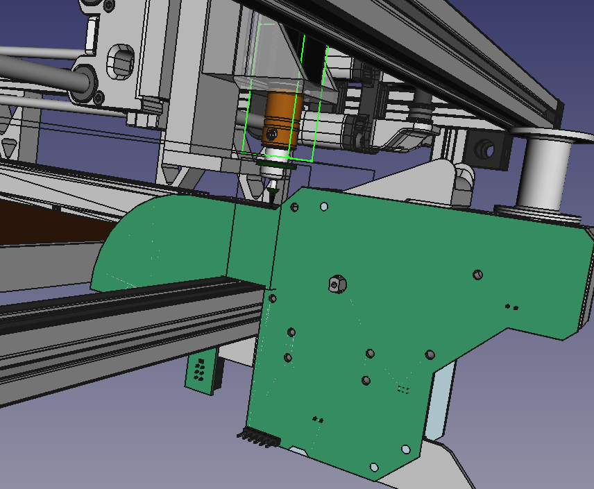
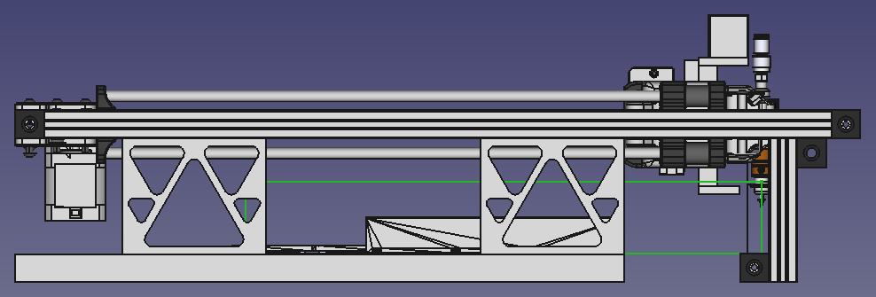
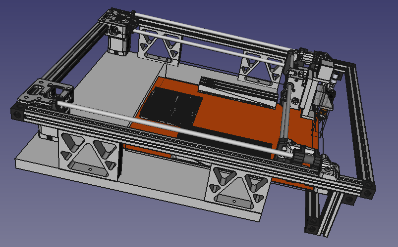
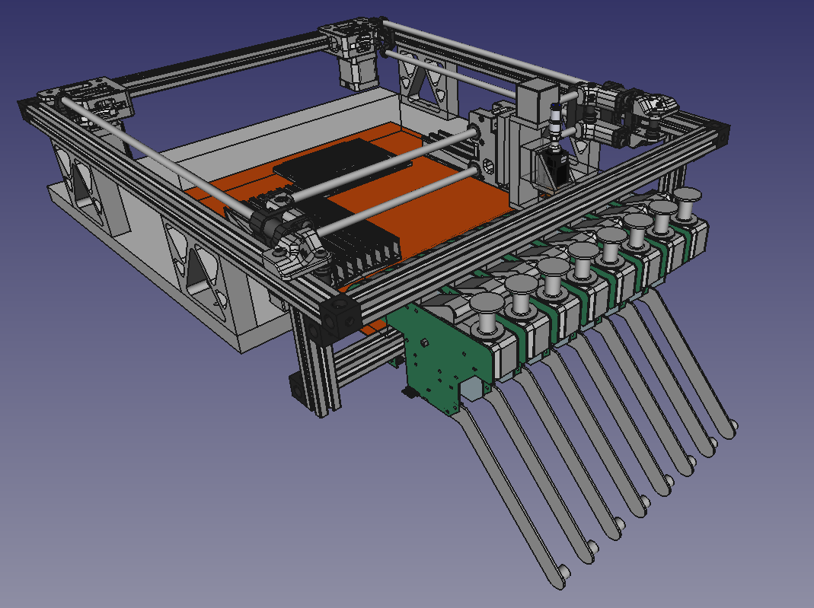
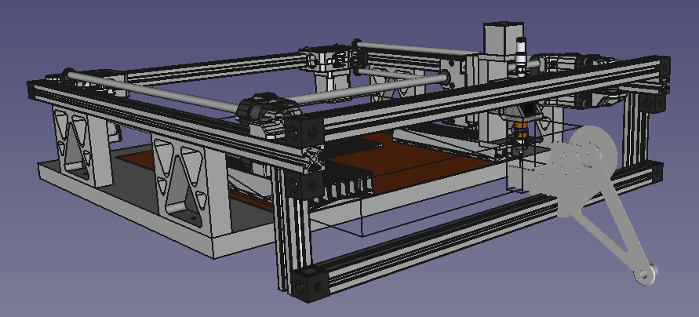

So, a homage to both the corexy franchise (thanks to [VORON Legacy](https://www.vorondesign.com/voron_legacy)) and also to [Stephen Hawes and the index PnP](https://github.com/index-machines/index) community. It was Stephen's enthusiasm that encouraged me to build my own PnP from scratch (as "scratchy" as one can sitting on the shoulders of giants!).

Voila!

AND! All with stock standard pieces, being:

* 2020 T-Slot 2x550mm
* 2020 T-Slot 3x450mm
* 2020 T-Slot 2x100mm

The "build" area is technically now 310x360mm (see green wireframe box). If you opt out of the feeder rack, you can use the entire space with a larger board base.

So, for linear bearings, you now need:

* 8mm dia 2x400mm
* 8mm dia 4x450mm

Et voila!

And, plenty of clearance (ignoring the bottom of the Z-Axis in the working area, I still need getting around to lifting that).

It otherwise will sit flat on a bench top.

Et encore voila!

It might even be doable with only one 19mm base (remembering the stanchion are 81mm to take the height to 100mm), because the sheet steel work are might be rotated. May be facilitated by use of, you guessed it, magnets to hold the sheet in place.

Encore une fois voila!

I am expecting the Z-Axis and feeder stepper widgetry to turn up in the next few weeks. So I splurged and ordered the extrusions, the corner pieces and the 8mm linear rods.

This will be a project over Christmas upcoming. Found a local metal supplier and hopefully they'll supply the 330x380x1mm plate for the working surface - to provide 10mm all around the 310x360mm volume of the platform.

Since you asked, it's eight Index type feeders max.

l' huit

But, feeders are negotiable and feeder options abound.

Mon Ami!

They just need hang over the edge of your desk ... somewhat.
