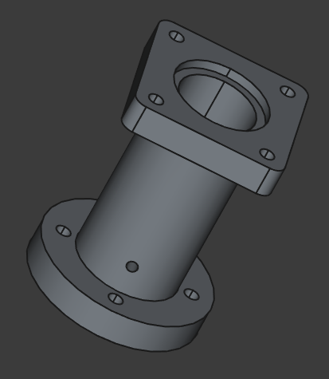
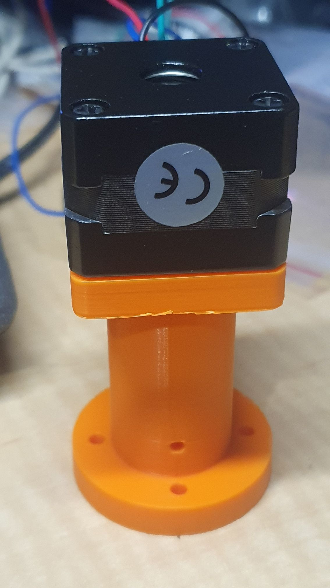

Can't help but start new projects. So, in the background, I am pulling together the BOM for:

https://www.youtube.com/watch?v=wI4Jh-T0Tlo

However, I am making a few mods (as you do) but I've printed most parts so far except for end effectors, as I want to redesign for a NEMA11 instead of the NEMA8. That'll be the bigger effort.

The pissy little round NEMA14 motor in ARM 3 (so called, use to rotate the "wrist"), is being replaced with a NEMA14 52mm using:

So, I'm also replacing the 6002 bearings with 6201RS 12x32x10 mm, bought 12mm OD 6mm ID hollow cylindrical rod to insert into the 6201RS bearings, and then 6mm OD rod for the wrist driver. The trick being the 6002 is 32mm OD as well. Nuasance it's 9mm thick while 6201RS is 10mm thick. So I had to hack the step file of the section to allow for bearings to be inserted deeper.

So I need a 5mm to 6mm coupler, and the motor adaptor has space internal to take that arrangement.

Above is a NEMA14 28mm sitting atop the prototype piece (the 52mm'll be more or less twice the body size).
