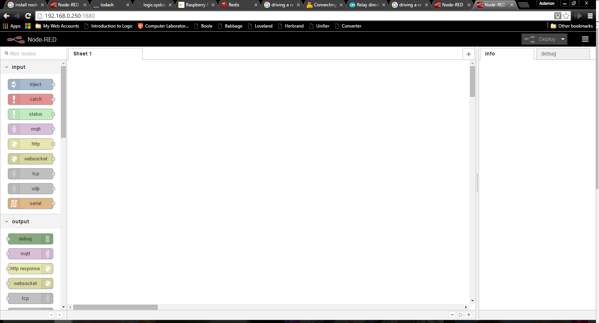
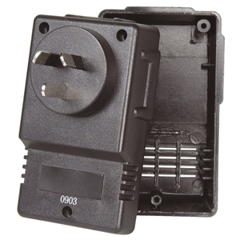

node-red running on my odroid-w.
I have [my old blackwidow](https://organicmonkeymotion.wordpress.com/2015/05/15/esp4/) working with a relay shield so I can drive sprinkler valves but I could not sort mqtt onto the older dopey wifi shield - just lazy.  So I will use node-red to drive tcp chatter to drive the relays and drive that with mqtt via the node-red.  That way I can integrate the board gently, using its current libraries.
Next experiments include, yes, sorting that static IP story.
Then getting mosquitto up and running.
There are a few warnings in the node-red install that I need address (upgrades of dependencies).  Otherwise I am looking at a thingybox the size of a matchbox.
Sensibly though I am looking at a small 220VAC-5VDC module to build the whole thing into a 3 Pin Plug Pack Case.

Yes, yes.  All would have been easier with a fresh download of the Jessi distro - since it comes with node-red.  But I do like the labour.
Still, the final version will be on a fresh Jessi distro so that I only need the mosquitto install to get this rolling.
