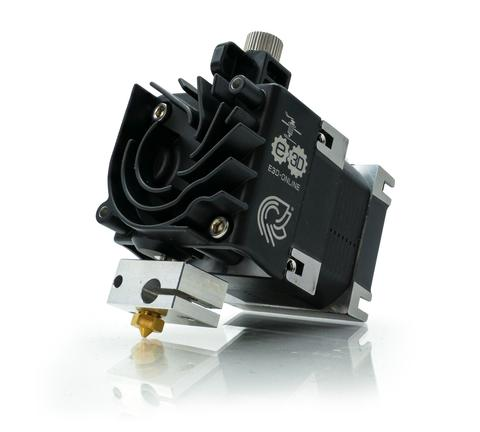
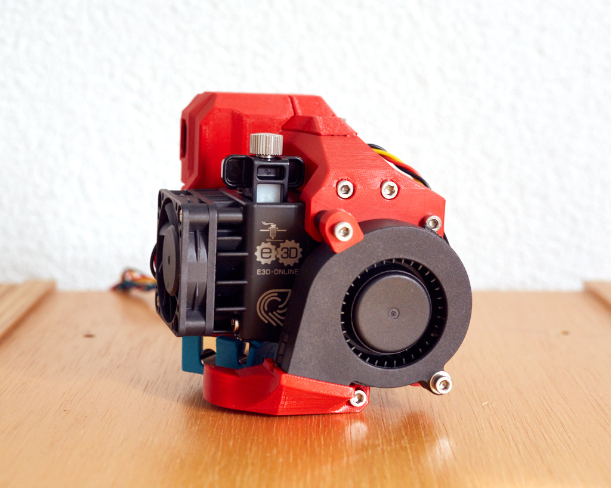

Just doing the last sprint on my Bear build.

Opted for the E3D Hermia direct drive with V6 full metal hot end, voila!

So that'll look a bit like the following!

Had to track down the fan on the side. Purchase ONLY from Prusa IFF you have one of their printers - I don't, I am building from scratch. So, found one here at [PHASER FPV](https://www.phaserfpv.com.au/products/prusamk3printfan5v). PHASER also had an E3D Prusa Specific Thermistor, so I grabbed one.

All coming together nicely.
