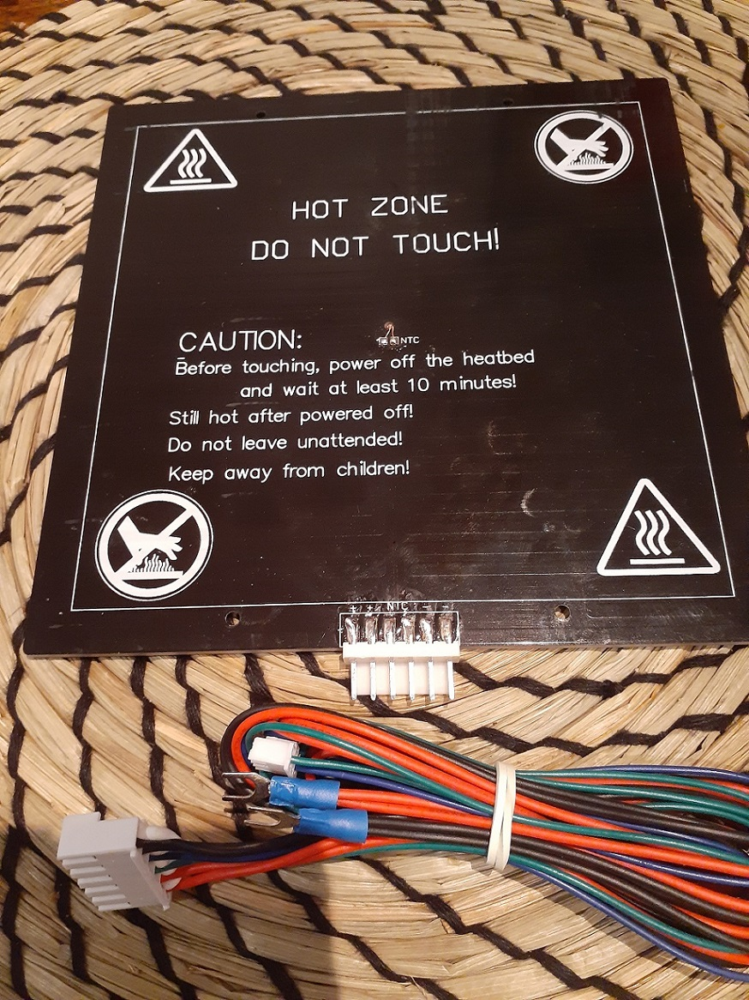
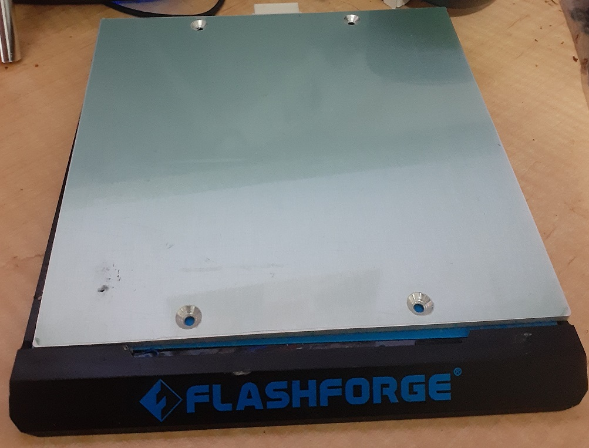
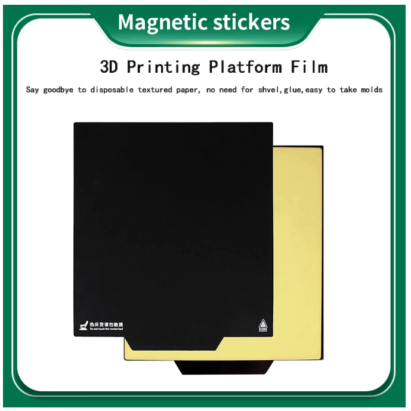
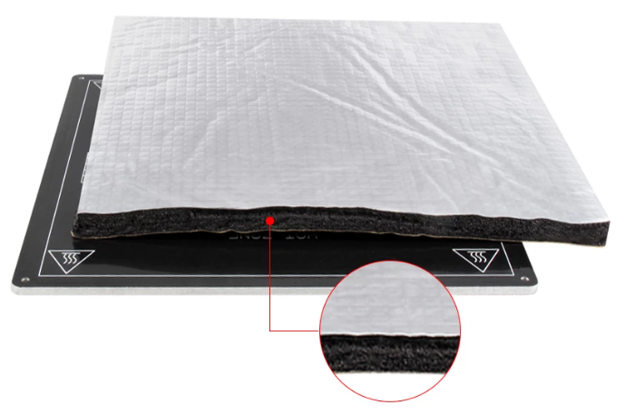
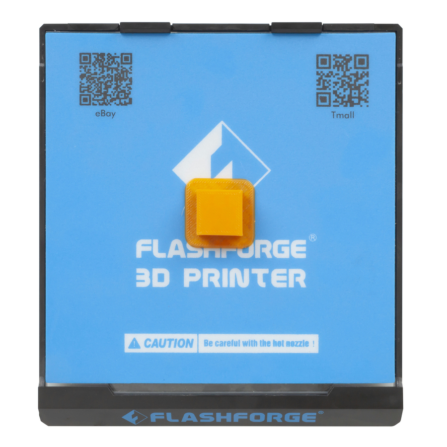

Ta da!

So, the hot plate has turned up, being 156mm on a side, and it appears will fit snuggly onto my Finder bed.

Smooth!

Just needs a little thinking about to mount it. But then there is the thermostat, which looks like I can scavange from my small heating experiment for the 11U cabinet I had the Finder in.

Just waiting on some magnetic bedding.

And a wad of insulation wool to go between the heated bed and the base.

Ordered a [spare Finder base from Jaycar](https://www.jaycar.com.au/spare-removable-bed-tl4220-tl4222/p/TL4223).

I ordered the second base since I'll lift out the glass and bolt the heated bed to the base, with the insulation pad in between.
