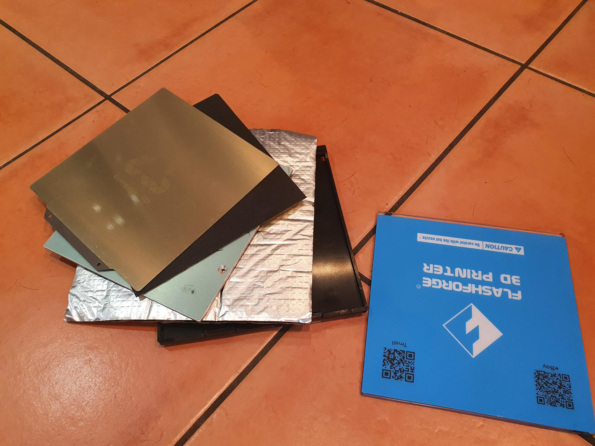
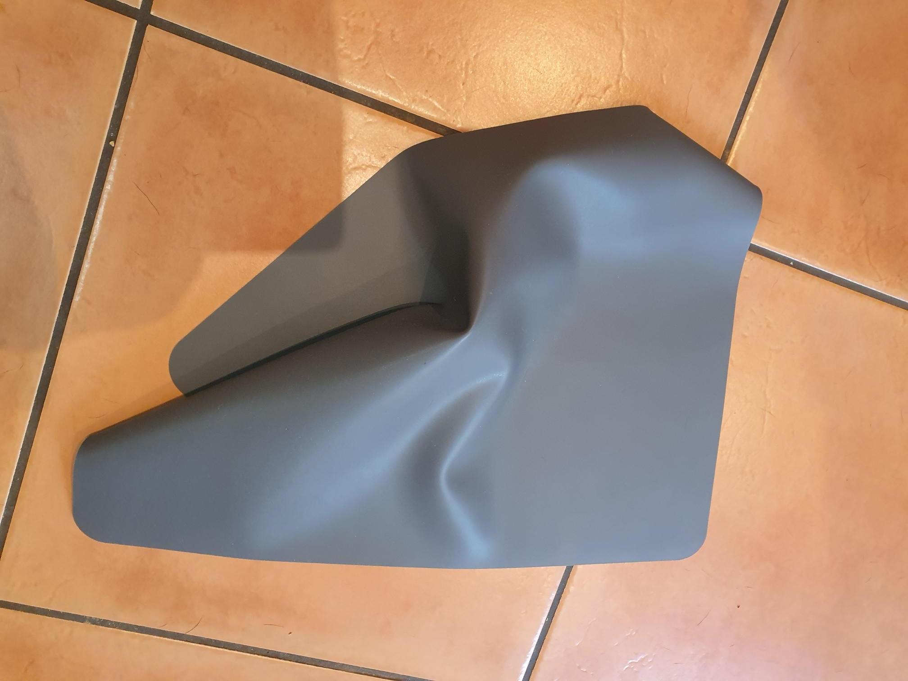
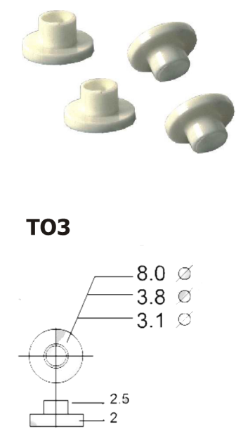

[Following up part 1](https://organicmonkeymotion.wordpress.com/2022/08/17/hot-plates-for-finders-part-1/). That is, modify a Flashforge Finder to add a heated print bed.

**Plan A**

Plan A

* [Buy second removable Flashforge Finder bed](https://www.jaycar.com.au/spare-removable-bed-tl4220-tl4222/p/TL4223) tray.
* Remove glass from finder bed.
* [Buy insulation mat, 200x200](https://www.aliexpress.com/item/33002961558.html?spm=a2g0o.order_list.0.0.5c521802WngGuM)mm to trim down to fit Finder bed sans glass.
* [Buy 160x160mm heated bed](https://www.aliexpress.com/item/1005004110358095.html?spm=a2g0o.order_list.0.0.5c521802WngGuM) (fits more or less to Finder bed.
* [Buy magnetic bed (tape), 200x200](https://www.aliexpress.com/item/1005003024888968.html?spm=a2g0o.order_list.0.0.5c521802WngGuM)mm to trim down to fit heated bed.
* [Buy flexible metal print bed](https://www.aliexpress.com/item/33002350997.html?spm=a2g0o.order_list.0.0.5c521802WngGuM), 165x165mm (so what to a little overhang).

**Plan B**

Plan B

Silicon mat from homeware's store. Either to use instead of the insulation mat, or at least to provide flat silicon washers (handcrafted) to try to keep as much metal away from plastic.

Meanwhile, I think I'll also try to get hold of T03 insulating bushings to ensure no metal contact with plastic. I'll need the T03 insulating bushings wherever the M3 bolts need to mate with the Flashforge Finder bet tray.

[T03 insulated bushings](https://www.jaycar.com.au/to-3p-silicon-rubber-insulating-kit-pk-4/p/HP1174)

Because of how tight the dimensions with respect to the shelf in the printer that takes the removable print bed. I suspect I'll need to stand the hotbed about [10 mm off the removable bed](https://www.jaycar.com.au/m3-x-10mm-tapped-metal-spacers-pk8/p/HP0900?pos=8&queryId=389c01d1747d0bb2873b0e3abb6b9850&sort=relevance).
