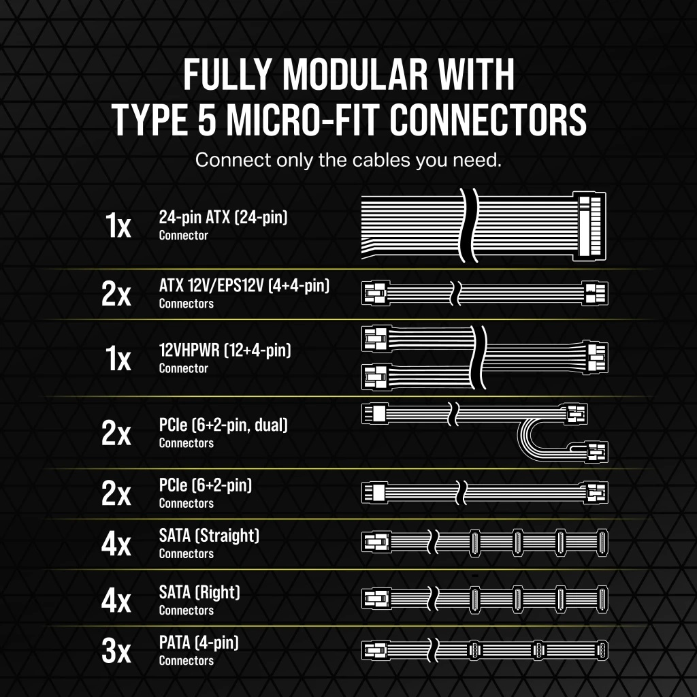
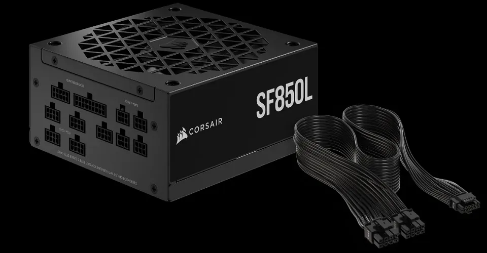
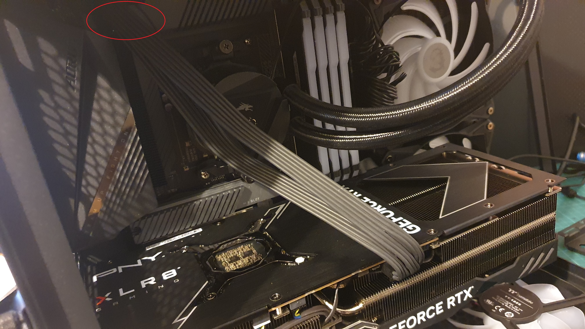
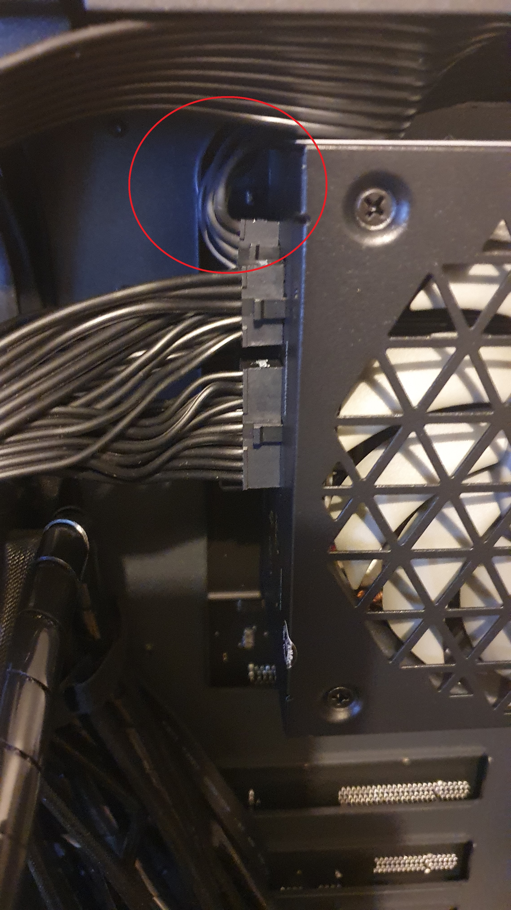

So, haven't built a PC in decades, certainly not one with a GPU, so if you're in the same boat then do a lot more reading that I did before I slung it together.

Outside of the glitch with the "nothing at HDMI port", [DOH](https://organicmonkeymotion.wordpress.com/2023/11/17/aaaaarrrggh/)!

The thing is, without any step by step build instructions, you get the feeling you're being played.

The GPU comes with a 3-headed connector (above) that seems happily to connect to 3x PCIe 6+2 connectors.

PSU comes with 2x (not 3x) PCIe (6+2-pin), making you think you got jipt - as you could swear that you need 3x.

You have to take note of this image and the text description with it.  Namely PCIe 5.0.  ATX 3.0. And not forgetting:

> PCIe 5.0 12VHPWR GPU cable included for use with modern graphics cards such as the NVIDIA® GeForce RTX™ 40 Series.

That is, you need to have known 12VHPWR means GPU when reading the table of cables above.

Hence, apparently, you throw out the 3 pronged cable provided by the GPU vendor and use the 12VHPWR (12+4-pin), which is just short enough to almost not be long enough to take the shortest straightest route  from my GPU to my PSU inside my Lian Li 011 dynamic mini.

Don't need no stinking GPU support, the GPU power cable is "tense"!

See the slight "tugging" of the connector in the PSU?

I would have loved to sneak it under the GPU an keep the "open air" space above.

Since it appears Nvidia are racing ahead with 50x series, I don't expect there is a "solution"? Since they appeare to be running away from 40x series?  Certainly in AUS. Who knows?  Is there a longer cable set, braided perhaps, to defend the Feng Shui of my machine?

**UPDATE**

So, in the end a little grumpy. I was relying on Mwave tech expertise, given I declared myself new builder or rusty. Specifically asking about components and compatibility with case, BEFORE purchasing what is a pretty penny's worth of STUFF!

There must be a known problem with Corsair lead lengths, since my latest enquiry for a fix confirms they knew Corsair leads were short and that was based upon a constrained set of build use cases - which likely did not include building a Lian Li O11 mini.

I couldn't even say I did this to myself, by buying a Corsair PSU instead of the Lian Li PSU MWave experts recommended. Both have 12VHPWR GPU leads of 400mm. So, we'd still be in the same position.

Say WHAT! Given the hypotenuse is always shorter than the sum of the opposite and adjacent sides of a right triangle, hmmm, even Lian Li seem to have botched this with the GPU power lead length, even knowing they have the O11 mini in their range of cases. In fact, I had to do a double take (since I took out the HDD cage) that there was one and only one option for PSU location. Sure enough, upper left position in the back. Tempting is that the PSU could go into the HDD cage location. But I would need make a piece up, since even the horizonal holes in the case do not line up with those it PSU.

Got told to find someone myself to build an extension cable as Mwave confirmed they have no source of cable solutions or cable extension hackers.

I ended up finding someone IS making Type 5 extensions for 12+4 so it'll be turning up in a couple of days.

**UPDATE**

Corsair help desk tells me they sell a Type 5 ["Premium" cable of 65cm](https://www.corsair.com/us/en/p/pc-components-accessories/cp-8920323/premium-individually-sleeved-12-4pin-pcie-gen-5-12vhpwr-600w-cable-type-5-gen-5-black). Would you believe these Type 5 cables do NOT turn up in a search of Australian sites (CP-8920323). Australia seems littered with Type 4 cables (CP-8920284 or CP-8920331).

Fun problem, the Corsair checkout system only has US in it as a posting address. They seem therefore to have dumped Type 5 PSU on the Australian market, without any support regarding cable length compatiblity problems. I may need fix this by changing PSU brand.

It's probably, therefore, as dicey buying a Corsair Type 5 PSU in Australia, as buying a Jeep. No "Lemon" laws in Australia.

I think I had it with this bogus idea of "Regions". I would say if a company manages sales by regions, then the Australian Government should put a bill into Parliment for internet providers to block sites that do not service Australia. No need to see the sites if the vendor cannot work out how to post to Australia. The idea of "regions" makes no sense in this day and age, where the world sells online, and most postage providers have jumped on the bandwagon. You are only delivering to you local post office or courier picks up, what's exactly your beef with Australia then?

**UPDATE**

Yeah. So I've an extension cable turning up from Amazon. But, I did like the Type 5 Premium cables, so I got around the limitation of the Corsair checkout with a US one time postal package forwarding option. So, I'll get the box up and running and swap in the Premium cable once it gets here.
