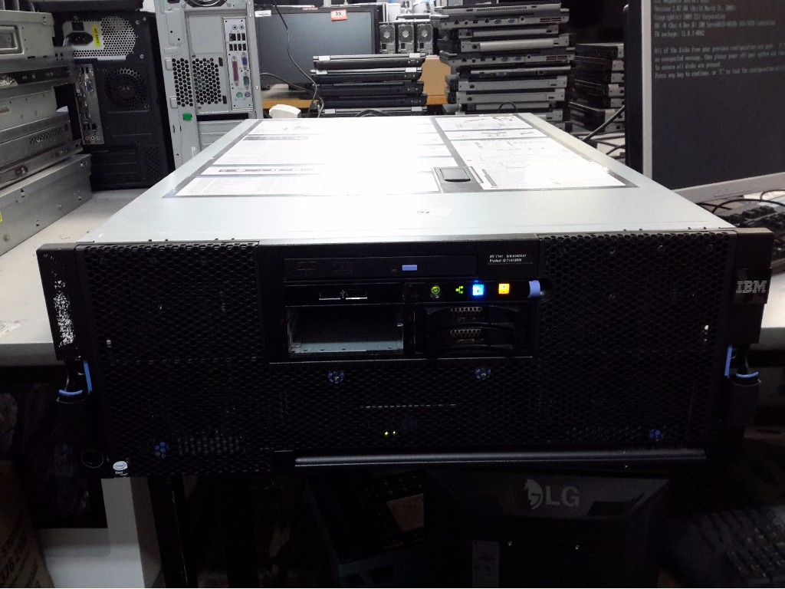

... wife will kill me!
Look what I bid on!

So, 4 cpu server with 70plus gig of memory.  Maybe dual cores (so eight all up), may be quad cores (so 16 all up).  Won't know until I grab it (if I win the auction).
I will have to install a hard drive.
Turns out Debian installs just fine, based upon web searches at least.
Why?
[Chapel box](http://chapel.cray.com/).
And cheaper than a Parallella.
Should be able to stuff at least one CUDA board in it - just need find a good second hand one.
Go figure, powers up but that's all I know.
I am so dead.
Mind you, both the wife and the mother in law are actually addicted now to the auction website.
So I feel vindicated ... but very, very afraid.
So why do I want to buy the second one they have?
Spares?
Death wish?
Is Charles Bronson channeling through me?

